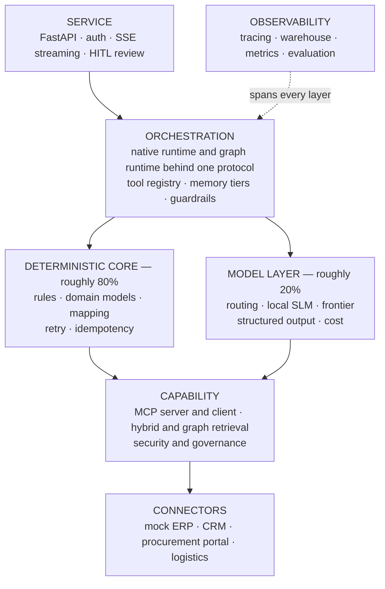

# Foreman

**An enterprise agent platform that shows its work.**

Foreman handles a real business process — checking supplier order confirmations, matching them against orders and invoices, and escalating the ones a human needs to look at — using AI agents. It takes the boring parts seriously:

- Business rules live in code, not in prompts.
- A write cannot happen twice, even if the network fails halfway.
- Search respects the permissions of the person asking.
- Every step is recorded.
- A human approves anything that cannot be undone.

> [!IMPORTANT]
> **Current status: Phase 0 complete.** The design is finished and written down, and the project scaffold now exists — configuration, the error taxonomy, and the quality gates. There is no agent yet: that is Phase 1. This README says what exists today and what is planned. See [Status](#status) for where each phase stands, and [docs/](docs/) for the design.

---

## The idea behind it

Most AI agent demos get the balance backwards.

In real enterprise automation, about **80% of the work is ordinary software engineering** — business rules, validation, talking to other systems, keeping an audit trail. Only about **20% needs an AI model**, and that part is reading messy documents, handling unclear cases, and matching names that are not written the same way.

Foreman is built that way round. Every part of the system is either **deterministic** (it follows fixed rules and always gives the same answer) or **model-driven** (it asks an AI model). Never both at once, and the folder structure makes clear which is which.

What that means in practice:

- Checking whether a price is within 3% of the agreed price is subtraction. A model should not be doing it.
- A spending limit is a rule in version control, not a sentence in a prompt.
- Permission checks, spending caps and duplicate-write protection all run in code, at the moment the action happens. So they still work even if the model has been tricked into asking for something it should not.

---

## The problem it solves

A buyer sends a purchase order. The supplier replies with a confirmation — a PDF, an email, or a record in a web portal — and it may not match the order. The price might be different. The quantity might be lower. The delivery date might have slipped.

Somebody has to decide, thousands of times a month, whether each difference is acceptable.

It is a good problem for an AI agent precisely because it is unexciting:

- The incoming documents really are messy, so a model is genuinely useful.
- The decision itself really is a rule, so it belongs in code.
- The writes cannot be undone, so safety matters.
- The truth is spread across four systems that disagree with each other.

---

## What it will demonstrate

| Area | Capability |
| --- | --- |
| **Agent engineering** | An agent loop written from scratch, with four conditions that stop it running forever · four agent designs: ReAct, plan-then-execute, reflection, routing · five ways to arrange work: chain, route, parallel, supervisor, evaluator-optimiser · one agent by default, with a written explanation of when more than one is worth it |
| **Memory** | Four kinds of memory — what the model sees now, what the run has worked out so far, what was looked up, and what happened in past runs — plus a way to shrink them when they get too big |
| **Protocol** | The full Model Context Protocol surface — tools, resources, prompts, completion, sampling, roots, elicitation, tasks — over two transports, with OAuth 2.1 login |
| **Integration** | Fake ERP, CRM, procurement and logistics systems · four ways to authenticate · deciding which system is right about which field · writes that cannot happen twice · retries, backoff and circuit breakers |
| **Knowledge** | Two search methods combined, so exact part numbers are not lost · permission filtering applied before ranking, not after · answers with citations, and disagreements shown rather than hidden · a knowledge graph for questions that need several hops |
| **Models** | One interface over a fake model, a local model, and five hosted providers — OpenAI, Anthropic, Google, Groq, OpenRouter · each declares what it can do · a fallback list per job · output checked against a schema, with a repair step · spending caps that stop the run before the money is spent |
| **Security** | Guardrails at three points · a collection of real prompt-injection attacks kept as tests · permission and spending limits enforced in code · tenants kept apart · personal data removed from logs, with deletion that is tested |
| **Operations** | OpenTelemetry tracing exported to Langfuse · a small analytics warehouse in DuckDB · recorded test runs, a scored judge, drift detection and a shadow mode · tests that block a merge if quality drops |

Every row maps to one folder and one detailed document in the [capability coverage map](docs/FOREMAN_SPEC.md#2-capability-coverage-map).

---

## Architecture



Reading the diagram from the top: a request arrives at the **service** layer, which passes it to the **orchestration** layer. That layer runs the agent loop, and draws on two separate things — the **deterministic core** for anything rule-based, and the **model layer** for anything that needs an AI model. Both then use the **capability** layer for search, protocol and security work, which in turn talks to the outside world through **connectors**. **Observability** records what happened at every level.

Full explanation: [docs/architecture.md](docs/architecture.md).

---

## Design decisions worth reading

| Decision | Short version |
| --- | --- |
| [Business rules are code, not prompts](docs/decisions.md#adr-001--business-rules-are-code-not-prompts) | A rule written in a prompt is followed *most* of the time, which is the worst kind of reliability. You also cannot unit test it, and an auditor will not accept it |
| [Two runtimes behind one protocol](docs/decisions.md#adr-002--two-runtimes-behind-one-protocol) | Write the agent loop by hand, because that is the part worth understanding. Use LangGraph for pausing and resuming runs, because rebuilding that badly teaches nothing |
| [Permission filtering before ranking](docs/decisions.md#adr-005--acl-filtering-before-scoring) | Telling a model to ignore a document it has already been shown is not access control |
| [One agent is the default](docs/decisions.md#adr-006--single-agent-is-the-default) | Each extra agent adds a hand-off, more delay, and a new way to fail |
| [Silent mistakes matter more than noisy ones](docs/decisions.md#adr-012--silent-errors-outrank-visible-ones) | Escalating too often is irritating, and you can tune it. Confirming something wrong and telling nobody is an incident |
| [What was deliberately left out](docs/decisions.md#adr-016--what-was-deliberately-left-out) | Ten things turned down, each with the reason |

---

## Tech stack

**Python 3.12** · **uv** · **Pydantic v2** · **FastAPI** · **LangGraph** · **httpx** · **Typer** · **JSON-RPC 2.0** · **numpy + rank_bm25** · **DuckDB + Parquet** · **OpenTelemetry + Langfuse** · **pytest + hypothesis** · **ruff + mypy** · **Docker** · **GitHub Actions**

Full list with the reason for each choice: **[docs/tech-stack.md](docs/tech-stack.md)**.

Model providers, all optional and chosen in a config file: **Ollama** (runs on your own machine) · **OpenAI** · **Anthropic** · **Google** · **Groq** · **OpenRouter**.

Optional services, each with a working substitute built in: **Ollama**, **Neo4j**, **pgvector**.

> **Everything important runs with no API keys and no external services.** A fake model provider and in-memory storage mean the tests pass on a fresh clone, in under a minute, with no internet. Anyone looking at this repository can run it straight away, which matters more than depth they will never get to.

---

## Quick start

These work today, after Phase 0:

```bash
git clone https://github.com/dileepadev/foreman.git
cd foreman
uv sync
uv run pytest          # passes with no API key and no internet
uv run foreman config  # shows resolved settings; never prints a credential
```

> [!NOTE]
> The commands below do not work yet — they arrive with the agent in Phase 1, and are the exact commands its checkpoint is measured against.

```bash
uv run foreman run --scenario happy-path        # confirms every line
uv run foreman run --scenario price-variance    # escalates, and names the rule that fired
```

---

## Status

Phases run in order because each one needs the last, not because of a calendar. Each phase ends with a checkpoint that either passes or does not.

| Phase | Scope | Status |
| --- | --- | --- |
| — | Specification and documentation | ✅ Complete |
| 0 | Project setup — uv, error types, configuration | ✅ Complete |
| 1 | Business rules and the agent loop | ⬜ Not started |
| 2 | MCP protocol and the four connectors | ⬜ Not started |
| 3 | Document loading, search, knowledge graph | ⬜ Not started |
| 4 | Tracing, analytics, testing | ⬜ Not started |
| 5 | API, security, privacy, governance | ⬜ Not started |
| 6 | Second runtime, multi-agent, model routing, deployment | ⬜ Not started |

Detailed checklists: [TODO.md](TODO.md). What each phase contains and how it is checked: [docs/FOREMAN_SPEC.md](docs/FOREMAN_SPEC.md#10-build-plan).

**Phase 1 is the point where this repository becomes worth reading.** Even if nothing after it gets built, Phase 1 gives you working business rules, an agent loop that stops properly, and a test suite that runs anywhere.

---

## Documentation

| | |
| --- | --- |
| [**Specification**](docs/FOREMAN_SPEC.md) | Scope, coverage map, architecture, stack, targets, build plan |
| [Architecture](docs/architecture.md) | Layers, rules that must not be broken, what happens during a run, how it fails |
| [Process decomposition](docs/process-decomposition.md) | Turning a business process into decision tables and an agent |
| [Agent architecture](docs/agent-architecture.md) | The runtime interface, agent designs, ways to arrange work |
| [Memory](docs/memory.md) | The four kinds of memory, and how to shrink them |
| [MCP](docs/mcp.md) | The full protocol, transports, login, and the attacks to defend against |
| [Integration](docs/integration.md) | Connectors, authentication, safe writes, handling failure |
| [Retrieval](docs/retrieval.md) | Loading documents, search, knowledge graph |
| [Models](docs/models.md) | Choosing a model per step, structured output, controlling cost |
| [Tech stack](docs/tech-stack.md) | Every dependency, why it was picked, what was turned down |
| [Security](docs/security.md) | Guardrails, permissions, prompt injection, privacy, governance |
| [Observability](docs/observability.md) | Traces, analytics, metrics, silent mistakes |
| [Evaluation](docs/evaluation.md) | Recorded test runs, judges, shadow mode, blocking bad merges |
| [Scalability](docs/scalability.md) | Waiting vs doing, limits, caching |
| [Operations](docs/operations.md) | uv, Docker, CI/CD, releases, long-term upkeep |
| [Runbook](docs/runbook.md) | What to do when something breaks |
| [Decisions](docs/decisions.md) | The decision log |
| [Glossary](docs/glossary.md) | What the words mean |

Full index: [docs/README.md](docs/README.md).

---

## Scope

Foreman is a **reference implementation built to professional standards**. It is not a live production system. There is no real customer data, no uptime promise, nobody on call, and the connectors are realistic fakes rather than real vendor integrations. The engineering is production quality; the operational promises are not.

What it deliberately is not, and why: [docs/FOREMAN_SPEC.md §1](docs/FOREMAN_SPEC.md#1-scope-and-non-goals).

---

## Contributing

Contributions are welcome. Please read:

- [CONTRIBUTING.md](CONTRIBUTING.md) — how to contribute
- [BRANCH_NAMING_GUIDELINES.md](BRANCH_NAMING_GUIDELINES.md) — branch naming
- [COMMIT_MESSAGE_GUIDELINES.md](COMMIT_MESSAGE_GUIDELINES.md) — commit format
- [PULL_REQUEST_GUIDELINES.md](PULL_REQUEST_GUIDELINES.md) — pull requests
- [CODE_OF_CONDUCT.md](CODE_OF_CONDUCT.md) — expected conduct
- [SECURITY.md](SECURITY.md) — reporting vulnerabilities

Working on this with an AI coding agent? Start at [AGENTS.md](AGENTS.md), which follows the [agents.md](https://agents.md/) standard.

---

## License

[MIT](LICENSE) © [dileepadev](https://github.com/dileepadev)
