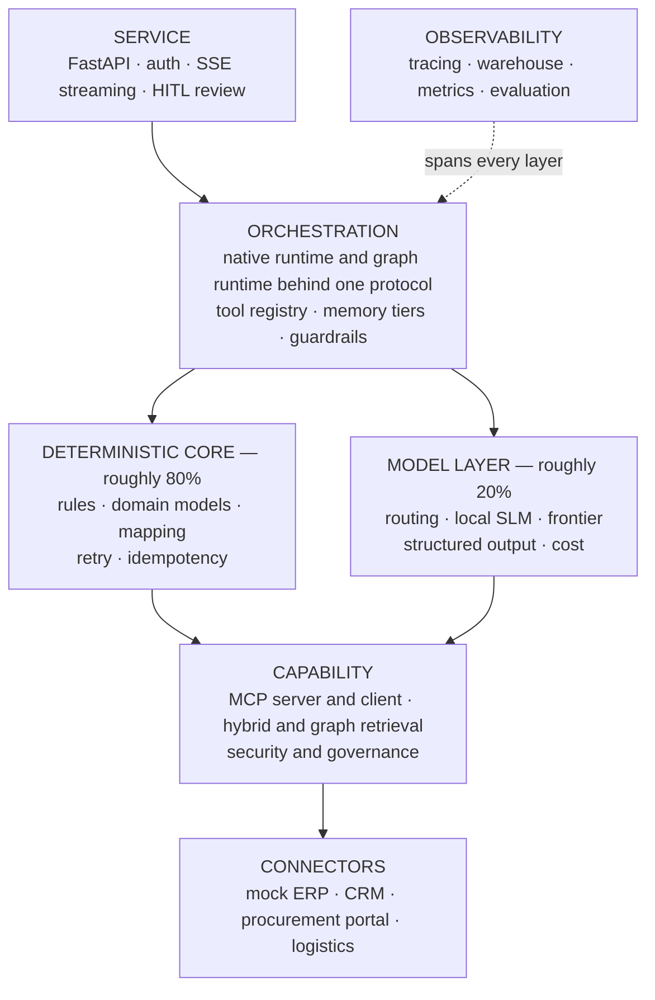

# Foreman

**An enterprise agent platform that shows its work.**

Foreman runs real operational processes — supplier order confirmation, multi-way matching, exception escalation — as autonomous agents, and treats the unglamorous parts as first-class: deterministic business rules, idempotent writes, permission-aware retrieval, full execution traces, and a human review path for anything irreversible.

> [!IMPORTANT]
> **Current status: specification.** The design is complete and documented; implementation has not started. This README describes what exists today and what is planned. See [Status](#status) for the phase-by-phase position and [docs/](docs/) for the specification.

---

## The premise

Most agent demos invert the ratio that matters.

In enterprise automation roughly **80% of the work is deterministic software engineering** — business rules, validation, integration, audit — and roughly **20% is probabilistic inference**, handling unstructured extraction, ambiguity and fuzzy entity matching.

Foreman is built the right way round, and the module boundaries make it explicit: every component is either deterministic or model-driven, never quietly both.

A tolerance comparison is a subtraction, not an inference. A spend threshold is a rule in version control, not a sentence in a system prompt. And every control that matters — authorisation, write ceilings, idempotency — is enforced in code at dispatch, so it still holds when the model has been fooled.

---

## The problem it solves

A buyer issues a purchase order. The supplier returns a confirmation — a PDF, an email, a portal record — that may differ in price, quantity or promised date. Somebody has to decide, thousands of times a month, whether each difference is acceptable.

It is a good agent problem precisely because it is unglamorous: the input is genuinely unstructured, the decision is genuinely a rule, the writes are irreversible, and the truth is spread across four systems that disagree.

---

## What it will demonstrate

| Area | Capability |
| --- | --- |
| **Agent engineering** | Hand-rolled agent loop with four stopping conditions · ReAct, plan-execute, reflection and routing patterns · chain, route, parallel, supervisor and evaluator-optimiser orchestration · single-agent default with a documented multi-agent trade-off |
| **Memory** | Context window, working state, retrieved and episodic tiers with budget-triggered compaction |
| **Protocol** | Full MCP surface — tools, resources, prompts, completion, sampling, roots, elicitation, tasks — over stdio and Streamable HTTP, with OAuth 2.1 authorization |
| **Integration** | Mock ERP, CRM, procurement and logistics connectors · four auth patterns · per-field source-of-truth resolution · deterministic idempotency · retry, backoff and circuit breaking |
| **Knowledge** | Hybrid dense + BM25 retrieval with rank fusion · ACL filtering before scoring · grounded generation with citations and conflict surfacing · GraphRAG for multi-hop impact analysis |
| **Models** | One protocol over mock, local Ollama and five hosted providers — OpenAI, Anthropic, Google, Groq, OpenRouter · capability negotiation · per-tier provider chains with fallback · structured output with a repair loop · token accounting with hard budget ceilings |
| **Security** | Three guardrail layers · prompt-injection corpus as tests · RBAC with write ceilings enforced at dispatch · multi-tenant isolation · PII redaction, retention and tested erasure |
| **Operations** | OpenTelemetry tracing with Langfuse export · DuckDB medallion warehouse · golden traces, calibrated judge, drift detection and shadow mode · evaluation as a CI merge gate |

Every row maps to an owning module and a deep-dive document in the [capability coverage map](docs/FOREMAN_SPEC.md#2-capability-coverage-map).

---

## Architecture



Full diagram and rationale: [docs/architecture.md](docs/architecture.md).

---

## Design decisions worth reading

| Decision | Short version |
| --- | --- |
| [Business rules are code, not prompts](docs/decisions.md#adr-001--business-rules-are-code-not-prompts) | A prompt rule is applied probabilistically, cannot be unit tested, and is not an answer an auditor accepts |
| [Two runtimes behind one protocol](docs/decisions.md#adr-002--two-runtimes-behind-one-protocol) | Hand-roll the loop because it is the lesson; use LangGraph for durability because rebuilding it badly teaches nothing |
| [ACL filtering before scoring](docs/decisions.md#adr-005--acl-filtering-before-scoring) | Asking a model not to use what it can already see is not access control |
| [Single agent is the default](docs/decisions.md#adr-006--single-agent-is-the-default) | Every extra agent adds hand-off surface, latency and a new failure mode |
| [Silent errors outrank visible ones](docs/decisions.md#adr-012--silent-errors-outrank-visible-ones) | Over-escalation is annoying and tunable; a silent wrong confirmation is an incident |
| [What was deliberately left out](docs/decisions.md#adr-016--what-was-deliberately-left-out) | Ten things declined, each with a reason |

---

## Tech stack

**Python 3.12** · **uv** · **Pydantic v2** · **FastAPI** · **LangGraph** · **httpx** · **Typer** · **JSON-RPC 2.0** · **numpy + rank_bm25** · **DuckDB + Parquet** · **OpenTelemetry + Langfuse** · **pytest + hypothesis** · **ruff + mypy** · **Docker** · **GitHub Actions**

Full dependency list, group layout and rationale: **[docs/tech-stack.md](docs/tech-stack.md)**.

Model providers, all optional and selected from configuration: **Ollama** (local) · **OpenAI** · **Anthropic** · **Google** · **Groq** · **OpenRouter**.

Optional services, all with tested in-process fallbacks: **Ollama**, **Neo4j**, **pgvector**.

> **Everything core will run with zero API keys and zero external services.** A mock model provider and in-memory stores mean the test suite passes on a clean clone, in under a minute, offline. Anyone evaluating the repository can run it immediately, which matters more than depth they will never reach.

---

## Quick start

> [!NOTE]
> Not yet available — implementation begins with Phase 1. These are the commands the Phase 1 gate is defined against.

```bash
git clone https://github.com/dileepadev/foreman.git
cd foreman
uv sync
uv run pytest                                   # green, no API key, no network
uv run foreman run --scenario happy-path        # confirms all lines
uv run foreman run --scenario price-variance    # escalates, names the rule that fired
```

---

## Status

Phases are dependency order, not a schedule. Each ends with a gate that either passes or does not.

| Phase | Scope | Status |
| --- | --- | --- |
| — | Specification and documentation | ✅ Complete |
| 0 | Scaffold — uv project, error taxonomy, configuration | ⬜ Not started |
| 1 | Deterministic core and the agent loop | ⬜ Not started |
| 2 | MCP protocol and enterprise connectors | ⬜ Not started |
| 3 | Ingestion, hybrid retrieval, GraphRAG | ⬜ Not started |
| 4 | Tracing, warehouse, evaluation | ⬜ Not started |
| 5 | API, security, privacy, governance | ⬜ Not started |
| 6 | Graph runtime, multi-agent, routing, delivery | ⬜ Not started |

Detailed checklists: [TODO.md](TODO.md). Phase definitions and gates: [docs/FOREMAN_SPEC.md](docs/FOREMAN_SPEC.md#10-build-plan).

**Phase 1 is the bar for this being worth reading.** If only Phase 1 ships, the repository is still a deterministic core, an agent loop with real stopping conditions, and a test suite that runs anywhere.

---

## Documentation

| | |
| --- | --- |
| [**Specification**](docs/FOREMAN_SPEC.md) | Scope, coverage map, architecture, stack, non-functional requirements, build plan |
| [Architecture](docs/architecture.md) | Layers, invariants, run lifecycle, failure model |
| [Process decomposition](docs/process-decomposition.md) | Business process → decision tables → agent specification |
| [Agent architecture](docs/agent-architecture.md) | Runtime protocol, agent and orchestration patterns |
| [Memory](docs/memory.md) | The four tiers and compaction |
| [MCP](docs/mcp.md) | Full protocol surface, transports, authorization, threats |
| [Integration](docs/integration.md) | Connectors, auth patterns, write safety, resilience |
| [Retrieval](docs/retrieval.md) | Ingestion, hybrid retrieval, GraphRAG |
| [Models](docs/models.md) | LLM/SLM routing, structured output, cost control |
| [Tech stack](docs/tech-stack.md) | Every dependency, why it, and what was rejected |
| [Security](docs/security.md) | Guardrails, RBAC, injection, privacy, governance |
| [Observability](docs/observability.md) | Traces, warehouse, metrics, silent errors |
| [Evaluation](docs/evaluation.md) | Golden traces, judges, shadow mode, CI gating |
| [Scalability](docs/scalability.md) | Sync/async, concurrency, rate limits, caching |
| [Operations](docs/operations.md) | uv, Docker, CI/CD, release, sustaining |
| [Runbook](docs/runbook.md) | Incident procedures |
| [Decisions](docs/decisions.md) | ADR log |
| [Glossary](docs/glossary.md) | Vocabulary |

Full index: [docs/README.md](docs/README.md).

---

## Scope

Foreman is a **reference implementation built to production engineering standards**. It is not a production system: no real tenant data, no SLA, no on-call rotation, and the connectors are mocks with realistic friction rather than vendor integrations. The engineering standards are production-grade; the operational commitments are not.

What it is deliberately not, and why: [docs/FOREMAN_SPEC.md §1](docs/FOREMAN_SPEC.md#1-scope-and-non-goals).

---

## Contributing

Contributions are welcome. Please read:

- [CONTRIBUTING.md](CONTRIBUTING.md) — how to contribute
- [BRANCH_NAMING_GUIDELINES.md](BRANCH_NAMING_GUIDELINES.md) — branch naming
- [COMMIT_MESSAGE_GUIDELINES.md](COMMIT_MESSAGE_GUIDELINES.md) — commit format
- [PULL_REQUEST_GUIDELINES.md](PULL_REQUEST_GUIDELINES.md) — pull requests
- [CODE_OF_CONDUCT.md](CODE_OF_CONDUCT.md) — expected conduct
- [SECURITY.md](SECURITY.md) — reporting vulnerabilities

Working on this with an AI coding agent? Start at [AGENT.md](AGENT.md).

---

## License

[MIT](LICENSE) © [dileepadev](https://github.com/dileepadev)
