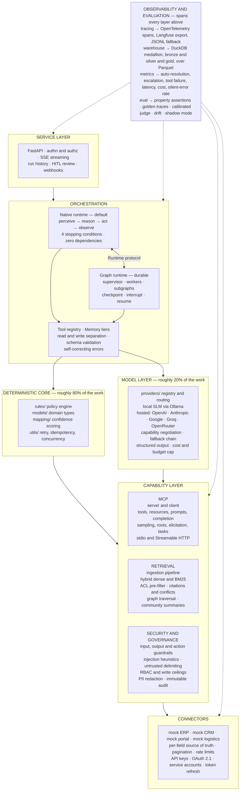

# Foreman — Technical Specification

**An enterprise agent platform that shows its work.**

Foreman runs real operational processes — supplier order confirmation, multi-way matching, exception escalation — as autonomous agents, and treats the unglamorous parts as first-class: deterministic business rules, idempotent writes, permission-aware retrieval, full execution traces, and a human review path for anything irreversible.

> Most agent demos invert the ratio that matters. In enterprise automation roughly **80% of the work is deterministic software engineering** — business rules, validation, integration, audit — and roughly **20% is probabilistic inference**, handling unstructured extraction, ambiguity and fuzzy entity matching. Foreman is built the right way round, and the module boundaries make it explicit: every component is either deterministic or model-driven, never quietly both.

---

## Table of contents

1. [Scope and non-goals](#1-scope-and-non-goals)
2. [Capability coverage map](#2-capability-coverage-map)
3. [The domain](#3-the-domain)
4. [Architecture](#4-architecture)
5. [Runtime and framework decisions](#5-runtime-and-framework-decisions)
6. [Subsystem specifications](#6-subsystem-specifications)
7. [Tech stack](#7-tech-stack)
8. [Non-functional requirements](#8-non-functional-requirements)
9. [Repository layout](#9-repository-layout)
10. [Build plan](#10-build-plan)
11. [Release cuts](#11-release-cuts)
12. [Repository hygiene](#12-repository-hygiene)
13. [Acceptance criteria](#13-acceptance-criteria)
14. [Document index](#14-document-index)

---

## 1. Scope and non-goals

### What Foreman is

A reference implementation of an applied-AI system for enterprise process automation, built to production engineering standards and readable end to end. Every architectural claim in this specification is backed by a module and a test, or it is marked as not built.

### What Foreman is not

| Not | Because |
| --- | --- |
| A production system | No real tenant data, no SLA, no on-call rotation. The engineering standards are production-grade; the operational commitments are not. |
| A framework | Foreman is an application. It borrows a framework where a framework earns its keep and hand-rolls where the mechanism is the lesson. |
| A model-training project | No fine-tuning, no pre-training. Everything is inference, retrieval, orchestration and control. |
| A vendor integration | Connectors target mock ERP, CRM, procurement and logistics systems with realistic shapes. No proprietary APIs, no employer systems, no customer data. |
| A benchmark chase | Correctness, auditability and cost control are the objectives. Leaderboard scores are not. |

### Operating constraints

These are hard constraints, and they shape the design more than any preference does.

- **Zero-cost by default.** The whole system runs on a laptop with no API keys and no paid services. Frontier-model calls are opt-in, budget-capped and kill-switched.
- **Clean-clone runnable.** `uv sync && uv run pytest` passes on a fresh clone with no network access to a model provider.
- **Single maintainer.** Every optional service must have an in-process fallback, or it does not ship.
- **Public repository.** No employer, product, customer or individual names anywhere. See [Repository hygiene](#12-repository-hygiene).

---

## 2. Capability coverage map

Each capability maps to exactly one owning module and one deep-dive document. Nothing is claimed that is not built, and nothing is built that no document explains.

### Agent engineering

| Capability | Owning module | Deep dive |
| --- | --- | --- |
| Generative vs agentic system boundary | `runtime/` | [agent-architecture.md](agent-architecture.md) |
| Agent loop with real stopping conditions | `runtime/native.py` | [agent-architecture.md](agent-architecture.md) |
| Agent architectures — ReAct, plan-execute, reflection, router | `runtime/patterns/` | [agent-architecture.md](agent-architecture.md) |
| Orchestration patterns — chain, route, parallel, supervisor, evaluator-optimiser | `runtime/graph.py` | [agent-architecture.md](agent-architecture.md) |
| Multi-agent, and when *not* to use it | `runtime/graph.py` | [agent-architecture.md](agent-architecture.md) |
| Tool design, schema generation, argument validation | `agent/tool_registry.py` | [agent-architecture.md](agent-architecture.md) |
| Memory — context window, working state, retrieved, episodic | `agent/memory/` | [memory.md](memory.md) |
| Durable execution, checkpointing, resume | `runtime/langgraph_runtime.py` | [agent-architecture.md](agent-architecture.md) |

### Protocol and integration

| Capability | Owning module | Deep dive |
| --- | --- | --- |
| MCP server — tools, resources, prompts, completion | `mcp_server/` | [mcp.md](mcp.md) |
| MCP client features — sampling, roots, elicitation | `mcp_server/`, `agent/mcp_client.py` | [mcp.md](mcp.md) |
| MCP utilities — progress, cancellation, logging, tasks, pagination | `mcp_server/utilities.py` | [mcp.md](mcp.md) |
| MCP transports — stdio and Streamable HTTP | `mcp_server/transport/` | [mcp.md](mcp.md) |
| MCP authorization — OAuth 2.1 resource server, audience binding | `mcp_server/auth.py` | [mcp.md](mcp.md) |
| MCP-specific threats — confused deputy, token passthrough, tool poisoning | `security/mcp_threats.py` | [mcp.md](mcp.md), [security.md](security.md) |
| Enterprise connectors — ERP, CRM, procurement, logistics | `connectors/` | [integration.md](integration.md) |
| Source-of-truth resolution per field | `connectors/resolver.py` | [integration.md](integration.md) |
| Auth patterns — API keys, OAuth 2.1, service accounts, token refresh | `connectors/auth/` | [integration.md](integration.md) |
| Schema mapping with confidence scoring | `mapping/` | [integration.md](integration.md) |
| Write safety — deterministic idempotency keys | `utils/idempotency.py` | [integration.md](integration.md) |
| Resilience — error classification, backoff, circuit breaking | `utils/retry.py` | [integration.md](integration.md) |

### Knowledge

| Capability | Owning module | Deep dive |
| --- | --- | --- |
| Ingestion — extraction, dedupe, categorisation, incremental re-index | `ingestion/` | [retrieval.md](retrieval.md) |
| Hybrid retrieval — dense + BM25 with rank fusion | `rag/retriever.py` | [retrieval.md](retrieval.md) |
| Permission-aware retrieval — ACL filter before scoring | `rag/retriever.py` | [retrieval.md](retrieval.md) |
| Grounded generation with citations and conflict surfacing | `rag/generator.py` | [retrieval.md](retrieval.md) |
| GraphRAG — entity graph, multi-hop traversal, community summaries | `rag/graph/` | [retrieval.md](retrieval.md) |

### Models

| Capability | Owning module | Deep dive |
| --- | --- | --- |
| LLM and SLM routing per step | `providers/router.py` | [models.md](models.md) |
| Local and hosted providers behind one protocol | `providers/local.py`, `providers/openai_compat.py`, `providers/anthropic.py`, `providers/google.py` | [models.md](models.md) |
| Provider selection, fallback chains, vendor portability | `providers/registry.py`, `providers/router.py` | [models.md](models.md) |
| Structured output and validation-repair loop | `providers/structured.py` | [models.md](models.md) |
| Token accounting, cost attribution, budget enforcement | `providers/cost.py` | [models.md](models.md) |

### Security, privacy and governance

| Capability | Owning module | Deep dive |
| --- | --- | --- |
| Guardrails — input, output and action layers | `security/guardrails/` | [security.md](security.md) |
| Prompt injection defence and untrusted-content delimiting | `security/injection.py` | [security.md](security.md) |
| Authentication — API keys, OAuth 2.1, service accounts | `api/auth.py` | [security.md](security.md) |
| Authorisation — RBAC, scopes, write ceilings, tenant isolation | `security/rbac.py` | [security.md](security.md) |
| Privacy — PII detection, redaction, retention, erasure | `security/privacy.py` | [security.md](security.md) |
| Governance — model registry, approvals, immutable audit | `governance/` | [security.md](security.md) |

### Operations

| Capability | Owning module | Deep dive |
| --- | --- | --- |
| Tracing — OpenTelemetry spans, Langfuse export | `obs/tracing.py` | [observability.md](observability.md) |
| Analytics warehouse — DuckDB medallion over Parquet | `obs/warehouse.py` | [observability.md](observability.md) |
| Quality and performance KPIs including silent-error rate | `obs/metrics.py` | [observability.md](observability.md) |
| Offline evaluation — golden traces, property assertions | `eval/suite.py` | [evaluation.md](evaluation.md) |
| LLM-as-judge with human calibration | `eval/judge.py` | [evaluation.md](evaluation.md) |
| Drift detection and shadow mode | `eval/drift.py`, `eval/shadow.py` | [evaluation.md](evaluation.md) |
| Async execution, concurrency caps, rate limits, backpressure | `api/limits.py`, `utils/concurrency.py` | [scalability.md](scalability.md) |
| Caching — exact, semantic and prompt cache | `providers/cache.py` | [scalability.md](scalability.md) |
| Containerisation and dependency management | `Dockerfile`, `pyproject.toml` | [operations.md](operations.md) |
| CI/CD with evaluation as a merge gate | `.github/workflows/` | [operations.md](operations.md) |
| Incident response | — | [runbook.md](runbook.md) |

### Process and delivery

| Capability | Artefact | Deep dive |
| --- | --- | --- |
| Business process → agent workflow translation | `docs/processes/` | [process-decomposition.md](process-decomposition.md) |
| Decision tables as the SME-reviewable contract | `rules/policies.py` | [process-decomposition.md](process-decomposition.md) |
| Operational KPI alignment | `obs/metrics.py` | [process-decomposition.md](process-decomposition.md) |
| Human-in-the-loop review UX | `api/review.py` | [process-decomposition.md](process-decomposition.md) |
| Architecture decisions and rejected alternatives | — | [decisions.md](decisions.md) |

---

## 3. The domain

Foreman automates **procure-to-pay exception handling**, a process chosen because it is unglamorous, rule-dense, and impossible to fake with a chat interface.

### The process

A buyer issues a purchase order. The supplier returns a confirmation — as a PDF, an email body, a portal record or an EDI-shaped payload — that may differ from the order in price, quantity or promised date. Goods arrive and a receipt is recorded. An invoice arrives. Somebody has to decide, thousands of times a month, whether each difference is acceptable.

### Why it is a good agent problem

| Property | Consequence for the design |
| --- | --- |
| Input is unstructured and heterogeneous | Genuine extraction work — the 20% that needs a model |
| The decision is a rule, not a judgement | Tolerance comparison is subtraction; it belongs in code |
| Mistakes cost money in both directions | Over-escalation wastes buyer time; silent wrong confirmation is an incident |
| Writes are irreversible | Idempotency, write ceilings and HITL are requirements, not features |
| Truth is spread across systems | Source-of-truth resolution per field, not per system |
| Policy is versioned and audited | Rules must be inspectable, testable and attributable |

### Systems in play

Four mock enterprise systems, with deliberately divergent field names, conventions and failure modes.

| System | Owns | Realistic friction |
| --- | --- | --- |
| **ERP** | Purchase orders, goods receipts, invoices, ledger | Cursor pagination, optimistic locking, 5xx under load |
| **CRM** | Supplier relationships, contacts, contract references | OAuth 2.1 client credentials, short-lived tokens |
| **Procurement portal** | Supplier confirmations, catalogue, price lists | API key auth, aggressive rate limiting, eventual consistency |
| **Logistics / WMS** | Shipments, ASNs, delivery events, dock schedules | Webhook delivery, out-of-order events, at-least-once semantics |

Full process decomposition, decision tables and scenario catalogue: [process-decomposition.md](process-decomposition.md).

---

## 4. Architecture



### The line that matters

The deterministic core and the model layer are separate boxes on purpose. A tolerance comparison is a subtraction, not an inference. A spend threshold is a rule in version control, not a sentence in a system prompt.

Three invariants enforce that line in code:

1. **No module imports both `rules/` and `providers/`.** The agent composes them; neither knows about the other.
2. **Every model output crosses a Pydantic boundary** before it reaches a rule, a tool argument or a write.
3. **Every write is authorised by `security/rbac.py` at dispatch**, after the model has chosen and before anything happens. A model that decides to exceed its ceiling still cannot.

Full layer-by-layer treatment: [architecture.md](architecture.md).

---

## 5. Runtime and framework decisions

The most consequential decision in an agent project is what you build and what you borrow. Foreman's answer is explicit.

### Runtime protocol, two implementations

Both runtimes satisfy the same `Runtime` protocol, use the same tool registry, obey the same policy engine, and emit the same trace schema. A shared conformance suite runs against both — that is what keeps this a design decision rather than two half-finished engines.

| | **Native runtime** | **Graph runtime** |
| --- | --- | --- |
| Module | `runtime/native.py` | `runtime/langgraph_runtime.py` |
| Dependencies | None beyond Pydantic | LangGraph |
| Owns | Single-agent loop, deterministic tests, CI default | Multi-agent orchestration, durable execution, HITL interrupts |
| Why it exists | The loop is the lesson. Hand-rolling perceive→reason→act→observe with real stopping conditions is the difference between using agents and understanding them. | Durability, checkpointing, resume-after-interrupt and supervisor topologies are solved problems. Rebuilding them badly teaches nothing and ships less. |
| Default for | `uv run pytest`, CLI scenarios, offline evaluation | The served API, anything with a human approval step |

### Why LangGraph

Evaluated against the capabilities this project actually needs, not against popularity.

| Requirement | LangGraph | Why it decided the choice |
| --- | --- | --- |
| Durable execution and resume | Checkpointer per thread | An escalation can wait days for a human; the run must survive a restart |
| Human-in-the-loop | `interrupt()` / `Command(resume=...)` | Pause mid-graph, persist, resume with the reviewer's decision — the exact shape of the review queue |
| Short vs long-term memory | Checkpointer (thread) + Store (cross-thread) | Maps directly onto the memory tiers in [memory.md](memory.md) |
| Multi-agent topologies | Subgraphs, supervisor, handoffs | Orchestration patterns become configuration, not bespoke plumbing |
| Observability | OpenTelemetry-compatible, first-class Langfuse integration | One trace schema across both runtimes |
| Control | Explicit graph, no hidden control flow | The whole point of this repository is that the reasoning is inspectable |

Alternatives considered and why they lost: [decisions.md](decisions.md) — ADR-002.

### What is deliberately hand-rolled

| Hand-rolled | Rather than | Because |
| --- | --- | --- |
| MCP server protocol layer | An MCP SDK | JSON-RPC framing, capability negotiation and lifecycle *are* the subject. The client side uses the SDK, so both sides of the wire are covered. |
| Tool registry and schema generation | Framework-native tools | Read/write separation and write ceilings need to live in the registry itself |
| Rules engine | A BRMS | Twelve rules with versions and provenance. A rules product would be more machinery than domain. |
| Hybrid retrieval and rank fusion | A vector database | Dense + BM25 fusion in fifty lines shows why vector-only search loses part numbers |
| Idempotency, retry, concurrency primitives | Off-the-shelf | Small, load-bearing and worth being able to explain line by line |

---

## 6. Subsystem specifications

Condensed statements of intent. Each links to the document that specifies it fully.

### 6.1 Deterministic core → [architecture.md](architecture.md)

Domain models are Pydantic v2 with field-level constraints, so an invalid `PurchaseOrder` cannot be constructed. The rules engine evaluates versioned policies and returns **which rule fired**, not a boolean — an escalation that cannot name its cause is not auditable. Three-way matching is pure and total.

### 6.2 Agent runtime → [agent-architecture.md](agent-architecture.md)

Four stopping conditions: explicit terminal signal, step ceiling, token ceiling, cycle detection over a sliding window. Halting returns a `StopReason` **and the partial state** — an escalation carries context, it does not just stop. Tools are registered with an explicit `mutates` flag; the registry tracks reads and writes separately and RBAC enforces the difference at dispatch.

### 6.3 Memory → [memory.md](memory.md)

Four tiers with explicit eviction policy: the **context window** (what the model sees this turn), **working state** (structured facts held outside the window), **retrieved** (pulled on demand, cited, never silently persisted), and **episodic** (past runs for the same supplier, summarised). Tool outputs are projected to needed fields before entering the window, and summarisation is triggered by a budget, not a vibe.

### 6.4 MCP → [mcp.md](mcp.md)

Full protocol coverage against the 2025-11-25 revision. Server features: tools, resources, prompts, completion, `listChanged` notifications, cursor pagination. Client features: sampling, roots, elicitation. Utilities: progress, cancellation, logging, tasks. Transports: stdio and Streamable HTTP. Authorization: OAuth 2.1 resource server with Protected Resource Metadata, audience-bound tokens and an explicit no-token-passthrough rule.

### 6.5 Connectors and integration → [integration.md](integration.md)

Four mock systems with divergent conventions, because the divergence is what makes mapping meaningful. Source-of-truth is resolved **per field, not per system**: one system owns price, another owns promised date. Conflicts are detected and surfaced, never silently resolved. Auth patterns are demonstrated one per connector: API key, OAuth 2.1 client credentials, service account, and delegated user token with single-flight refresh.

### 6.6 Retrieval → [retrieval.md](retrieval.md)

Hybrid dense + BM25 with reciprocal rank fusion and a tokeniser that preserves hyphens, so `WDG-003-A` and `WDG-003-B` stay distinguishable. ACL filtering is applied **before scoring**: asking a model not to use what it can already see is not access control. Generation cites inline and surfaces contract-versus-amendment conflicts with dates rather than picking a winner. GraphRAG answers the multi-hop question vector search cannot: *if this component is discontinued, which parent assemblies and delivery schedules are affected?*

### 6.7 Models → [models.md](models.md)

One `LLMProvider` protocol over a scripted mock, a local SLM via Ollama, and hosted providers — OpenAI, Anthropic, Google, Groq and OpenRouter — each declaring its capabilities so the router never dispatches a step a provider cannot serve. A tier resolves to an ordered provider chain from configuration, so changing vendor is editing TOML. The router selects per step — small model for extraction, classification and routing; frontier for genuine judgement — and `cost.py` accounts tokens per run so the saving is **measured rather than asserted**. A hard budget ceiling with a kill switch is a first-class feature, not a nice-to-have.

### 6.8 Security, privacy and governance → [security.md](security.md)

Guardrails in three layers: **input** (injection heuristics, PII detection, untrusted-content delimiting), **output** (schema validation, groundedness, policy compliance), **action** (RBAC allow-lists, write ceilings, idempotency, mandatory HITL above thresholds). The attack corpus ships as tests. Privacy covers PII redaction in traces, retention windows and erasure across the trace store, warehouse and vector index — the requirement most systems discover too late.

### 6.9 Observability and evaluation → [observability.md](observability.md), [evaluation.md](evaluation.md)

OpenTelemetry spans exported to Langfuse, with append-only JSONL as the zero-dependency fallback. A DuckDB medallion warehouse turns traces into KPIs including **silent-error rate** — completions that were wrong and were not flagged. Evaluation runs golden traces with property assertions, a judge calibrated against human labels, drift monitors on input distribution and outcome rates, and shadow mode with writes suppressed.

### 6.10 Scalability → [scalability.md](scalability.md)

Async-first I/O with a synchronous facade for scripting, blocking work quarantined to a thread pool, bounded concurrency with per-item isolation, per-tenant rate limits and token-bucket quotas, backpressure at the queue rather than the connection, and a three-tier cache: exact, semantic and provider prompt cache.

### 6.11 Service and operations → [operations.md](operations.md), [runbook.md](runbook.md)

FastAPI with SSE streaming, run history, a HITL review queue carrying a diff payload a reviewer can act on in seconds, and webhook escalation. Packaged with uv and a multi-stage Docker build. CI runs lint, types, tests, the security corpus and **the evaluation suite as a merge gate** — a pull request that regresses the golden traces or blows the cost budget does not merge.

---

## 7. Tech stack

| Layer | Choice | Why |
| --- | --- | --- |
| Language | **Python 3.12** | Type hints, pattern matching, `X \| None` syntax |
| Packaging | **uv** | Lockfile-backed reproducible installs, dependency groups, fast CI, single tool for env and run |
| Validation | **Pydantic v2** | Runtime validation of model output before it touches anything |
| Service | **FastAPI** + **SSE** | Async, streaming, OpenAPI for free |
| Agent orchestration | **LangGraph** | Durable execution, checkpointing, HITL interrupts, supervisor topologies |
| HTTP | **httpx** | Async client with timeouts, pooling and transport-level retry hooks |
| CLI | **Typer** | Demo scenarios runnable from the terminal |
| Protocol | **JSON-RPC 2.0** over stdio and Streamable HTTP | MCP transport; the server is hand-rolled to show the wire format is understood, the client uses the official **MCP Python SDK** |
| Retrieval | **numpy** + **rank_bm25** | Dense and sparse without hiding behind a vector database |
| Vector store | **pgvector** *(optional)* | Swappable behind an interface; in-memory default |
| Graph | **Neo4j** *(optional, Docker)* | Cypher traversal, with an in-memory fallback so tests need no service |
| Analytics | **DuckDB** + **Parquet** | Medallion layering for metrics without a warehouse |
| Local models | **Ollama** *(optional)* | Model routing demonstrated against a real local endpoint |
| Hosted models | **OpenAI · Anthropic · Google · Groq · OpenRouter** *(all optional)* | Selectable per tier from configuration; no vendor is load-bearing |
| Tracing | **OpenTelemetry** + **Langfuse** | Standard shape; Langfuse self-hosted via compose or free tier |
| Testing | **pytest** + **pytest-asyncio** + **hypothesis** | Property assertions, async fixtures, generative tests on the rules engine |
| Quality | **ruff**, **mypy --strict** | Enforced in CI |
| Container | **Docker** multi-stage, **docker compose** | Optional services isolated |
| CI | **GitHub Actions** | Lint, types, tests, security corpus, evaluation gate |

Complete dependency list, group layout, version policy, licence posture and what was rejected: **[tech-stack.md](tech-stack.md)**.

**Deliberate constraint: everything core runs with zero API keys and zero external services.** A mock model provider and in-memory stores mean `uv run pytest` passes on a clean clone. Ollama, Neo4j, pgvector and Langfuse are opt-in. Anyone evaluating the repository can run it in under a minute, which matters more than depth they will never reach.

---

## 8. Non-functional requirements

Targets are measured by `obs/metrics.py` and asserted where the assertion is meaningful. They describe the reference workload — a 12-line purchase order against the mock connectors — not a capacity promise.

### Performance

| Metric | Target | Enforced by |
| --- | --- | --- |
| Single-run latency, mock provider, p95 | < 2s | `tests/test_performance.py` |
| Single-run latency, local SLM, p95 | < 30s | Benchmark, reported not asserted |
| Agent steps per happy-path run | ≤ 6 | Property assertion in the golden suite |
| Tool call latency, mock connector, p95 | < 50ms | `tests/test_performance.py` |
| Concurrent runs on a laptop | 20 without degradation | Load script in `scripts/` |
| Retrieval latency over 10k chunks, p95 | < 200ms | Benchmark |

### Cost

| Metric | Target | Enforced by |
| --- | --- | --- |
| Default configuration cost | $0.00 | Mock and local providers only |
| Cost per run, routed configuration | < $0.02 | `providers/cost.py` |
| Cost reduction, routed vs frontier-only | ≥ 60%, measured | `eval/cost_benchmark.py` |
| Per-run hard ceiling | Configurable, default $0.10 | Budget guard raises `BudgetExceeded` |
| Daily budget kill switch | Configurable, default $1.00 | Guard trips before the call, not after |

### Quality

| Metric | Target | Enforced by |
| --- | --- | --- |
| Golden-suite property assertions | 100% pass | CI merge gate |
| Silent-error rate | 0 on the golden suite | `obs/metrics.py` |
| Escalation precision on the labelled set | ≥ 0.90 | `eval/suite.py` |
| Judge agreement with human labels | ≥ 0.80 (Cohen's κ) | `eval/judge.py` calibration report |
| Injection corpus unauthorised writes | 0 | `tests/test_security.py` |
| Type coverage | `mypy --strict` clean | CI |
| Test coverage on `rules/` and `utils/` | ≥ 95% | CI |

### Reliability

| Property | Requirement |
| --- | --- |
| Write semantics | Exactly-once per idempotency key, verified under simulated timeout-after-success |
| Run durability | A run interrupted for review survives process restart and resumes |
| Degradation | Frontier provider unavailable → route to local; graph store unavailable → in-memory fallback; Langfuse unavailable → JSONL trace, never a dropped run |
| Failure isolation | One failed line item does not fail the run; one failed run does not fail the batch |

---

## 9. Repository layout

Phase markers show when a module first appears. Directories are created when their phase starts — empty folders for future phases read as abandoned scaffolding.

**Path convention.** Foreman uses a `src/` layout, so the importable package is `src/foreman/`. Throughout this documentation a module is cited by its path *inside* the package — `rules/engine.py` means `src/foreman/rules/engine.py`, and imports read `from foreman.rules import engine`. The src layout matters here for a specific reason: top-level `models/`, `utils/` and `core/` directories are generic enough to shadow real distributions on `sys.path`, and a flat layout also lets tests import the working directory instead of the installed package.

```text
foreman/
├── pyproject.toml                   # uv project, dependency groups, tool config
├── uv.lock
├── Dockerfile                       # multi-stage, uv sync --locked --no-editable
├── docker-compose.yml               # optional: neo4j, postgres+pgvector, ollama, langfuse
├── .github/workflows/               # ci.yml, eval.yml, release.yml
│
├── docs/                            # see §14
├── scripts/                         # load test, corpus generation, benchmarks
├── tests/                           # mirrors the package tree
│   ├── conformance/                 # runs against every Runtime implementation
│   ├── corpus/                      # injection attacks, golden traces, labelled sets
│   └── ...
│
└── src/foreman/                     # src layout: the installed package
    ├── core/
    │   ├── config.py                    # settings, env loading, feature flags
    │   ├── errors.py                    # TransientError, PermanentError, ToolError, PolicyViolation
    │   └── types.py                     # shared aliases, protocol base types
    │
    ├── models/                          ── PHASE 1
    │   ├── procurement.py               # PurchaseOrder, OrderLine, SupplierConfirmation, GoodsReceipt
    │   ├── agent_state.py               # ToolCall, ToolResult, AgentStep, AgentState, StopReason
    │   └── tenancy.py                   # Tenant, Principal, Role, Scope
    │
    ├── rules/                           ── PHASE 1
    │   ├── engine.py                    # versioned evaluation, returns the rule that fired
    │   ├── policies.py                  # tolerance bands, spend thresholds, approval matrix
    │   ├── matching.py                  # two- and three-way match, deterministic
    │   └── decision_tables.py           # SME-reviewable tables, loaded and validated
    │
    ├── utils/                           ── PHASE 1
    │   ├── retry.py                     # backoff, jitter, error classification, circuit breaker
    │   ├── idempotency.py               # deterministic keys, dedupe store
    │   ├── concurrency.py               # bounded_gather with per-item isolation
    │   ├── pagination.py                # cursor iteration with guards
    │   └── clock.py                     # injectable time, so time-dependent rules are testable
    │
    ├── providers/                       ── PHASE 1 (mock) → PHASE 6 (real)
    │   ├── base.py                      # LLMProvider protocol, ProviderCapabilities
    │   ├── registry.py                  # name → provider, built from config
    │   ├── mock.py                      # scripted, deterministic, no network
    │   ├── local.py                     # Ollama
    │   ├── openai_compat.py             # OpenAI, Groq, OpenRouter, Ollama-compat
    │   ├── anthropic.py                 # native Messages API
    │   ├── google.py                    # native Gemini API
    │   ├── structured.py                # structured output with validation-repair
    │   ├── router.py                    # tier selection + provider fallback chain
    │   ├── pricing.toml                 # per-model rates, versioned
    │   ├── cache.py                     # exact + semantic response cache
    │   └── cost.py                      # token accounting, budget guard, kill switch
    │
    ├── agent/
    │   ├── tool_registry.py             ── PHASE 1  schema generation, read/write separation
    │   ├── prompts.py                   ── PHASE 1  versioned, with regression pass rates
    │   ├── memory/                      ── PHASE 2  window, working, retrieved, episodic
    │   └── mcp_client.py                ── PHASE 2
    │
    ├── runtime/                         ── PHASE 1 → PHASE 6
    │   ├── protocol.py                  # Runtime protocol both implementations satisfy
    │   ├── native.py                    ── PHASE 1  hand-rolled loop, 4 stopping conditions
    │   ├── langgraph_runtime.py         ── PHASE 6  durable, checkpointed, interruptible
    │   ├── graph.py                     ── PHASE 6  supervisor and worker topology
    │   └── patterns/                    ── PHASE 6  react, plan_execute, reflect, route
    │
    ├── mcp_server/                      ── PHASE 2 → PHASE 5
    │   ├── protocol.py                  # JSON-RPC framing, lifecycle, capability negotiation
    │   ├── server.py                    # tools, resources, prompts, completion
    │   ├── utilities.py                 # progress, cancellation, logging, tasks
    │   ├── transport/                   # stdio.py, streamable_http.py
    │   ├── auth.py                      ── PHASE 5  OAuth 2.1 resource server, PRM discovery
    │   └── handlers.py                  # bound to connectors
    │
    ├── connectors/                      ── PHASE 2
    │   ├── base.py                      # Connector protocol
    │   ├── auth/                        # api_key.py, oauth.py, service_account.py, refresh.py
    │   ├── erp.py                       # POs, receipts, invoices
    │   ├── crm.py                       # suppliers, contacts, contracts
    │   ├── portal.py                    # confirmations, catalogue, price lists
    │   ├── logistics.py                 # shipments, ASNs, delivery events
    │   └── resolver.py                  # source-of-truth per field, conflict detection
    │
    ├── mapping/                         ── PHASE 2
    │   ├── schema_mapper.py             # candidate mappings with confidence + weight
    │   └── review.py                    # human-reviewable mapping report
    │
    ├── ingestion/                       ── PHASE 3
    │   ├── extract.py                   # text + table extraction
    │   ├── dedupe.py                    # content hashing, near-duplicate detection
    │   ├── categorise.py                # classification + metadata tagging incl. access_roles
    │   └── pipeline.py                  # incremental re-index, deletion propagation
    │
    ├── rag/                             ── PHASE 3
    │   ├── chunker.py                   # paragraph boundaries, overlap, metadata carry-through
    │   ├── retriever.py                 # dense + BM25, rank fusion, ACL pre-filter
    │   ├── generator.py                 # grounded answers, citations, conflict surfacing
    │   └── graph/                       # entity extraction, traversal, community summaries
    │
    ├── obs/                             ── PHASE 4
    │   ├── tracing.py                   # OpenTelemetry spans, JSONL fallback
    │   ├── langfuse_export.py           # trace → generation → span → event
    │   ├── warehouse.py                 # DuckDB medallion over Parquet
    │   └── metrics.py                   # KPIs including silent-error rate
    │
    ├── eval/                            ── PHASE 4
    │   ├── suite.py                     # golden scenarios, property assertions
    │   ├── judge.py                     # rubric scoring + human calibration
    │   ├── drift.py                     # input distribution + outcome rate monitoring
    │   ├── shadow.py                    # writes suppressed, decisions compared
    │   └── cost_benchmark.py            # routed vs frontier-only
    │
    ├── security/                        ── PHASE 5
    │   ├── guardrails/                  # input.py, output.py, action.py
    │   ├── injection.py                 # heuristics + untrusted-content delimiting
    │   ├── rbac.py                      # allow-lists, write ceilings, escalation bands
    │   ├── privacy.py                   # PII detection, redaction, retention, erasure
    │   ├── masking.py                   # secret redaction in logs and traces
    │   └── mcp_threats.py               # confused deputy, passthrough, poisoning checks
    │
    ├── governance/                      ── PHASE 5
    │   ├── registry.py                  # model, prompt and rule versions in use
    │   └── audit.py                     # append-only, hash-chained decision log
    │
    ├── api/                             ── PHASE 5
    │   ├── main.py                      # FastAPI app, lifespan, health
    │   ├── auth.py                      # API keys, OAuth 2.1, service accounts
    │   ├── limits.py                    # per-tenant rate limits, concurrency caps, quotas
    │   ├── runs.py                      # start run, stream events over SSE
    │   ├── history.py                   # conversation + run persistence, resume
    │   └── review.py                    # HITL queue, diff payload, approve/reject
    │
    ├── notify/                          ── PHASE 5
    │   └── webhook.py                   # escalation delivery with the diff, signed
    │
    └── cli.py                        ── PHASE 1  Typer entry point
```

---

## 10. Build plan

Six phases. **Each ends with a command that either passes or does not.** Phases are dependency order, not a schedule — do not start one before the previous gate is green. A repository that does two things properly beats one that does eight halfway.

### Phase 0 — Scaffold

- `uv init` with a `src/` layout, Python 3.12, and the dependency groups defined in [tech-stack.md §4](tech-stack.md#4-dependency-groups): `dev`, `api`, `mcp`, `graph`, `models`, `rag`, `pgvector`, `obs`.
- `core/errors.py` — the error taxonomy everything else classifies against.
- `core/config.py` — settings with feature flags for every optional service.
- Package directories for Phase 1 modules only.
- README stating what exists and what does not.

**Gate:** `uv sync` succeeds; `uv run pytest` collects zero tests without error; `uv run mypy .` clean.

### Phase 1 — Deterministic core and the agent loop

Self-contained, no API key, demoable alone. **If you build only this, the repository is still worth having.**

- **Domain models** — `OrderLine`, `PurchaseOrder` with computed total, `ConfirmedLine` with `extraction_confidence`, `SupplierConfirmation`, `GoodsReceipt`. Constrain at field level: `quantity: int = Field(gt=0)`.
- **Agent state** — `ToolCall`, `ToolResult` with `latency_ms` and `error_kind`, `AgentStep`, `StopReason`, `AgentState` with `is_over_limits()` and cycle detection covering consecutive repeats *and* two-tool oscillation over a sliding window. Signature = tool name + canonical sorted arguments.
- **Rules engine** — tolerance bands and spend thresholds, each with `version` and human-readable `description`; evaluation returns which rule fired; three-way match pure and deterministic. Decision tables loaded from a format an SME can read. *Keep this module entirely free of model calls.*
- **Resilience** — `classify_http_error` (fail fast on 4xx except 429; retry 429 and 5xx; honour `Retry-After`), backoff with jitter, deterministic idempotency keys over the business payload plus a time bucket, `bounded_gather`.
- **Tool registry** — `@registry.tool(name, description, mutates)` generating JSON Schema from type hints, validating arguments before dispatch, returning structured `ToolError` with `error_type`, `message` and `suggestion` — never a traceback.
- **Provider protocol and mock** — `complete(messages, tools) -> ProviderResponse`; the mock plays a scripted sequence so the whole agent is testable with no network.
- **Prompts** — versioned, with explicit negative constraints, a few-shot trajectory, and a slot for regression pass rate.
- **Native runtime** — the loop, four stopping conditions, returning a `StopReason` and the partial state.
- **CLI** — `foreman run --scenario happy-path | price-variance | partial | quantity-short`.

**Gate:**

```bash
uv run pytest -v                                # all green
uv run foreman run --scenario happy-path        # confirms all lines, <= 6 steps
uv run foreman run --scenario price-variance    # escalates, names the rule that fired
```

### Phase 2 — Protocol and integration

- **`mcp_server/protocol.py`** — JSON-RPC 2.0 request, response, error, framing, lifecycle and capability negotiation. **Written by hand rather than imported** — understanding the wire format is the point.
- **Connectors** — ERP, CRM, portal and logistics as mocks with deliberately **different field names and conventions** for the same entities. That divergence is what makes mapping meaningful.
- **Auth patterns** — one per connector: API key, OAuth 2.1 client credentials, service account, delegated token with single-flight refresh.
- **`connectors/resolver.py`** — source-of-truth registry **per field, not per system**. Conflicts detected and surfaced, never silently resolved.
- **`mcp_server/server.py`** — stdio transport exposing tools (`get_purchase_order`, `get_supplier` read; `confirm_order_line` write and idempotent; `escalate_to_buyer` HITL), resources (`erp://purchase-orders/{id}`, `erp://tolerance-policy`), prompts (`review_supplier_confirmation`), and completion for resource arguments.
- **`agent/mcp_client.py`** — connect over stdio, discover via `tools/list`, `resources/list`, `prompts/list`, dispatch `tools/call`, inject results into agent state, namespace tools by server.
- **`mapping/schema_mapper.py`** — **candidate field mappings with confidence and weight scores** rather than a blind transform; `review.py` renders a report a human accepts or rejects per field.
- **`agent/memory/`** — working state outside the context, tool-output projection to needed fields, budget-triggered summarisation.

**Gate:** `uv run python -m mcp_server` handles `initialize`, `tools/list` and `tools/call` over stdio; the agent completes a scenario end to end through the MCP client; connector conflict detection surfaces a price disagreement between ERP and portal; `uv run pytest tests/test_mcp.py tests/test_connectors.py tests/test_mapping.py` green.

### Phase 3 — Knowledge

- **Ingestion** — text and table extraction from a mixed corpus; exact content hashing plus near-duplicate detection; classification attaching `access_roles` and `supplier_id`; incremental re-index with deletion propagation so a superseded document stops being retrievable.
- **Chunking** — paragraph boundaries with overlap, metadata carried through.
- **Hybrid retrieval** — dense cosine plus BM25 with a tokeniser that **preserves hyphens and alphanumerics**; reciprocal rank fusion; **ACL pre-filter applied before scoring, not after**.
- **Grounded generation** — inline citations required; conflict detection between a base contract and a later amendment, surfacing both with dates.
- **GraphRAG** — entity graph with multi-hop traversal and community summaries. In-memory by default; Cypher against Neo4j when configured.

**Gate:** retrieval returns the correct chunk for an exact part number where dense-only fails; a query as a role lacking permission returns nothing from restricted documents; graph traversal answers a two-hop impact question; `uv run pytest tests/test_rag.py tests/test_ingestion.py` green.

### Phase 4 — Observability and evaluation

- **Tracing** — OpenTelemetry spans covering step index, reasoning, tool, arguments, output, latency and tokens, with append-only JSONL as the no-dependency fallback and a CLI viewer, because an unreadable trace is just a log file.
- **Langfuse export** — trace → generation → span → event.
- **Warehouse** — DuckDB medallion: bronze raw traces, silver conformed runs, gold aggregated KPIs, persisted as Parquet.
- **Metrics** — auto-resolution rate, escalation rate, tool failure rate by tool, latency percentiles, cost per run, and **silent-error rate**: completions that were wrong and were not flagged. That last one decides whether anyone trusts the system.
- **Golden suite** — scenarios with property assertions on tool invocation order, forbidden-tool invariants, arguments and final state.
- **Judge** — rubric scoring across accuracy, safety, completeness, tool selection and escalation appropriateness. **Ship a human-labelled calibration set and report agreement** — an uncalibrated judge just relocates the trust problem.
- **Drift** — input distribution and outcome rates over time, alerting on rate of change rather than single events.
- **Shadow mode** — write tools suppressed, decisions recorded and diffed against human decisions.

**Gate:** `uv run foreman eval` runs the golden suite at 100% property pass; `uv run foreman trace <run-id>` renders a readable trace; the warehouse produces a KPI table; shadow mode reports a decision diff.

### Phase 5 — Service, security and governance

- **Guardrails** — input, output and action layers wired into the runtime, each independently testable.
- **Injection defence** — heuristics for instruction overrides, role hijacks and delimiter attacks; untrusted content wrapped in explicit boundary tags. **Ship the attack corpus as tests.**
- **RBAC** — tool allow-lists per role, hard write ceilings, soft escalation bands, tenant isolation. Enforced at dispatch, never in a prompt.
- **Privacy** — PII detection and redaction in traces, retention windows, and erasure that reaches the trace store, the warehouse and the vector index.
- **Governance** — model, prompt and rule versions recorded per run; hash-chained append-only decision log.
- **API** — FastAPI with API-key, OAuth 2.1 and service-account authentication; per-tenant rate limits and concurrency caps; SSE run streaming; run history and resume; HITL queue where each item carries a **diff payload** — expected versus confirmed, the rule that fired, a link to the source — and `approve`/`reject` completes it.
- **MCP over HTTP** — Streamable HTTP transport with OAuth 2.1 resource-server authorization, Protected Resource Metadata discovery and audience validation.
- **Webhooks** — signed escalation delivery carrying the diff.

**Gate:** `uv run uvicorn api.main:app` serves; a run streams over SSE; an over-tolerance scenario produces a review item with a usable diff; **an injected document fails to trigger a write because RBAC blocks it regardless of what the model decided**; a token issued for another audience is rejected by the MCP HTTP endpoint; `uv run pytest tests/test_security.py tests/test_api.py` green.

### Phase 6 — Orchestration, models and delivery

- **Graph runtime** — LangGraph implementation of the `Runtime` protocol with checkpointing, `interrupt()`-based HITL and resume.
- **Multi-agent** — supervisor plus extraction, verification and escalation workers with explicit state hand-offs. **Document the trade-off:** single agent is the default; splitting is justified only when tool sets diverge, permissions differ, models differ, or hand-offs need supervision. Shipping both and saying which you would choose is a stronger signal than shipping only the complicated one.
- **Pattern library** — ReAct, plan-execute, reflection and routing as comparable implementations, benchmarked on the same scenarios.
- **Real providers** — Ollama locally, plus OpenAI, Anthropic, Google, Groq and OpenRouter behind the existing protocol. Two adapters cover all of them: a shared OpenAI-compatible client, and native adapters where the vendor's own API is materially richer.
- **Provider registry and chains** — each tier resolves to an ordered chain; a provider is skipped when unconfigured, circuit-broken, incapable or over budget. Every fallback is a trace span with a reason.
- **Router and cost** — small model for extraction, classification and routing; frontier for judgement; cost per run accounted so the saving is **measured rather than asserted**.
- **Caching** — exact, semantic and provider prompt cache, with hit rate reported.
- **Delivery** — multi-stage Dockerfile, compose with Neo4j, Postgres+pgvector, Ollama and Langfuse as **optional** services, and CI running lint, types, tests, the security corpus and the evaluation gate.

**Gate:** the conformance suite passes against both runtimes; CI green on a clean clone; `docker compose up` starts the stack; a run interrupted for review resumes after a process restart; the router demonstrably reduces cost per run against a single-frontier-model baseline.

---

## 11. Release cuts

Version numbers follow [VERSIONING.md](../VERSIONING.md). Cuts are defined by capability, not by date.

| Cut | Contains | Publicly defensible claim |
| --- | --- | --- |
| `v0.2.0` | Specification and documentation set | "Here is the design, the decisions and what is deliberately excluded." |
| `v0.3.0` | Phase 1 | "A deterministic core and an agent loop with real stopping conditions, tested." |
| `v0.4.0` | Phases 2–3 | "MCP, four enterprise connectors, hybrid and graph retrieval." |
| `v0.5.0` | Phases 4–5 | "Traced, evaluated, guarded and served." |
| `v1.0.0` | Phase 6 | "Two conformant runtimes, routed models, containerised, CI-gated on evaluation." |

Each cut updates [CHANGELOG.md](../CHANGELOG.md) and the README status table before tagging.

---

## 12. Repository hygiene

This is public. A few rules follow.

**No employer, product or individual names.** Not in code, comments, commit messages or documentation. The domain is generic procurement and field service — keep it that way.

**No interview scaffolding.** No `# INTERVIEW:` markers, no mapping tables between the code and a job description, no rehearsal module. Design rationale belongs in [decisions.md](decisions.md), written for any engineer reading it.

**Claim only what the code does.** The README describes what exists and a short roadmap for what does not. "Phase 2 complete, Phase 3 in progress" is a better signal than an ambitious README over a thin repository.

**Tests are the credibility.** Anyone evaluating this runs the tests before reading the code. Green tests on a small surface beat a large surface with none.

**Commit history is part of the artefact.** Small, coherent, well-messaged commits read as engineering discipline, following [COMMIT_MESSAGE_GUIDELINES.md](../COMMIT_MESSAGE_GUIDELINES.md). One giant initial commit of 8,000 lines reads as generated.

**Documentation is versioned with the code that it describes.** A document describing a module that does not exist says so in its first line.

---

## 13. Acceptance criteria

### Phase 1 — the bar for making it public

- `uv run pytest -v` green on a clean clone, no API key, no external service
- All four CLI scenarios run end to end
- `uv run mypy --strict` clean
- README accurately states what exists and what does not

### Full project

- Tests across every module, MCP protocol framing included
- MCP server initialises over both stdio and Streamable HTTP, and fulfils `tools/list`, `tools/call`, `resources/read` and `prompts/get`
- MCP HTTP endpoint rejects a token issued for a different audience
- Conformance suite passes identically against the native and graph runtimes
- Golden suite passes all property assertions with zero silent errors
- Traces export in Langfuse-compatible OpenTelemetry shape
- Injection corpus produces zero unauthorised writes
- A run interrupted for human review resumes after process restart
- Model router shows a measured cost reduction against a single-model baseline
- Erasure request removes a supplier from traces, warehouse and vector index
- CI green: lint, types, tests, security corpus, evaluation gate
- No proprietary or personal names anywhere in the repository

---

## 14. Document index

| Document | Covers |
| --- | --- |
| [architecture.md](architecture.md) | Layers, boundaries, data flow, the deterministic/probabilistic line |
| [tech-stack.md](tech-stack.md) | Every dependency, dependency groups, versions, licences, supply chain, what was rejected |
| [process-decomposition.md](process-decomposition.md) | Business process → decision tables → agent workflow; SME collaboration |
| [agent-architecture.md](agent-architecture.md) | Gen AI vs agentic, agent patterns, orchestration patterns, runtime protocol |
| [memory.md](memory.md) | Context window, working state, retrieved, episodic; compaction |
| [mcp.md](mcp.md) | Full MCP surface, transports, authorization, threat model |
| [integration.md](integration.md) | Connectors, auth patterns, source-of-truth, resilience, mapping |
| [retrieval.md](retrieval.md) | Ingestion, hybrid retrieval, permission filtering, GraphRAG |
| [models.md](models.md) | LLM vs SLM, local vs frontier, routing, structured output, cost |
| [security.md](security.md) | Guardrails, authn/authz, RBAC, injection, privacy, governance |
| [observability.md](observability.md) | Tracing, metrics, warehouse, analytics |
| [evaluation.md](evaluation.md) | Golden traces, judges, drift, shadow mode, CI gating |
| [scalability.md](scalability.md) | Sync vs async, concurrency, rate limits, caching, backpressure |
| [operations.md](operations.md) | uv, Docker, environments, CI/CD, release, sustaining engineering |
| [runbook.md](runbook.md) | What to do when it breaks |
| [decisions.md](decisions.md) | ADR log: what was chosen, what was rejected, what it cost |
| [glossary.md](glossary.md) | Domain and platform vocabulary |
