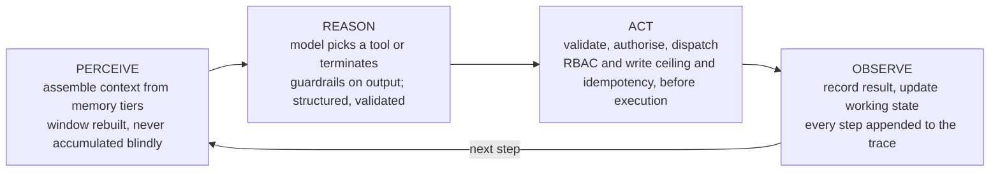
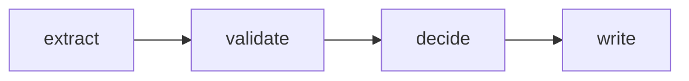
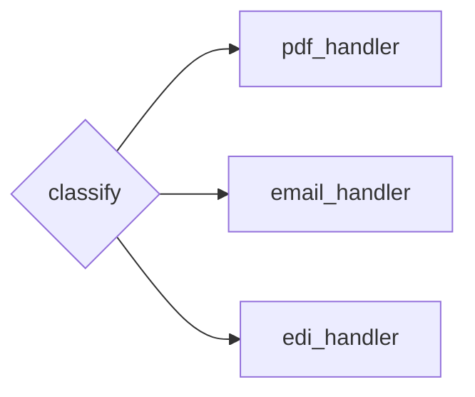
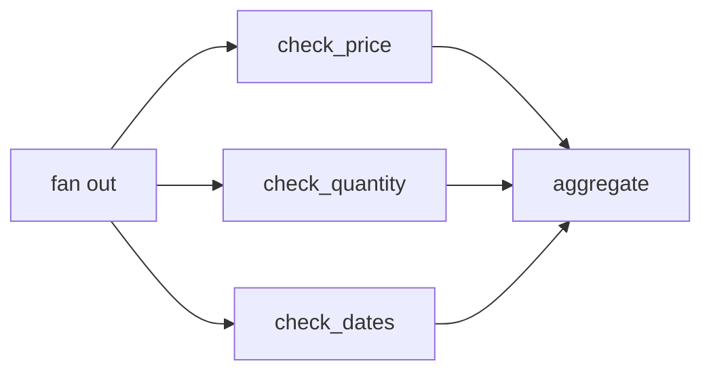
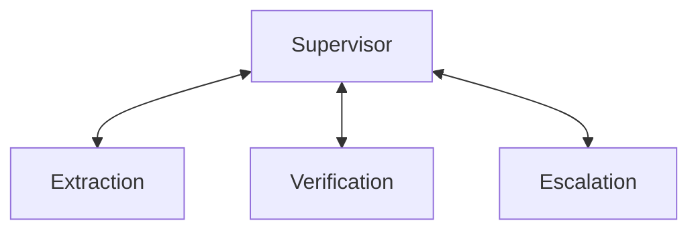
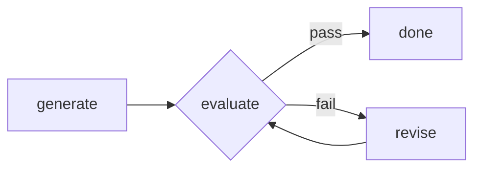
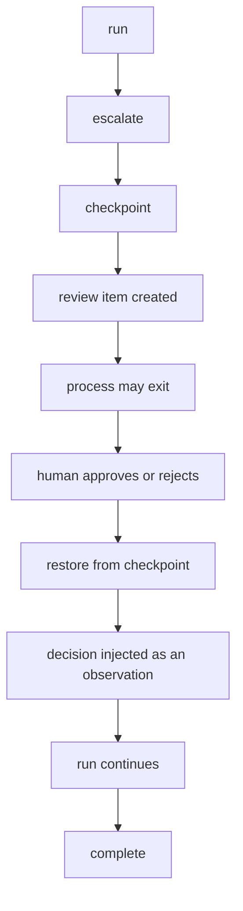

# Agent Architecture

> Status: specification. The native runtime is Phase 1; the graph runtime, pattern library and multi-agent topology are Phase 6.

What an agent is in this system, which architectures are implemented, how they are orchestrated, and — the part usually skipped — when not to use them.

## Table of contents

1. [Generative, agentic, and the line between](#1-generative-agentic-and-the-line-between)
2. [The runtime protocol](#2-the-runtime-protocol)
3. [The agent loop](#3-the-agent-loop)
4. [Stopping conditions](#4-stopping-conditions)
5. [Tool design](#5-tool-design)
6. [Agent architectures](#6-agent-architectures)
7. [Orchestration patterns](#7-orchestration-patterns)
8. [Single agent vs multi-agent](#8-single-agent-vs-multi-agent)
9. [Durable execution and human-in-the-loop](#9-durable-execution-and-human-in-the-loop)
10. [Conformance](#10-conformance)

---

## 1. Generative, agentic, and the line between

The terms are used loosely enough to be useless, so this project defines them by capability, not by vibe.

| | **Generative** | **Agentic** |
| --- | --- | --- |
| Control flow | Fixed by the caller | Decided at runtime by the model |
| Interaction | One request, one response | A loop over observations |
| Side effects | None — text out | Writes to systems of record |
| Failure mode | Wrong text | Wrong action, possibly irreversible |
| What it needs | A good prompt | Stopping conditions, authorisation, idempotency, audit |

The important consequence: **the moment a model's output selects the next action, prompt quality stops being the dominant risk and control becomes the dominant risk.** Foreman is an agentic system, so roughly 80% of its code is control.

### The spectrum this project actually implements

Ordered by how much control is delegated. Most useful enterprise automation lives in bands 2 and 3, not band 5 — and saying so is a design position, not a limitation.

| Band | Name | Who decides the next step | Used in Foreman |
| --- | --- | --- | --- |
| 1 | Single call | The programmer | Document classification |
| 2 | Chain | The programmer | Extraction → validation → decision |
| 3 | Router | The model picks a branch | Which retrieval strategy a question needs |
| 4 | Tool-calling loop | The model picks tools until done | The order-confirmation agent |
| 5 | Multi-agent | A supervisor model delegates | Complex reconciliation, Phase 6 |
| 6 | Open-ended autonomy | The model sets its own goals | **Not implemented, deliberately** |

Band 6 is excluded because no part of this domain benefits from it. A system that can decide its own objectives in a procurement ledger is a liability, not a feature.

---

## 2. The runtime protocol

Both execution engines satisfy one protocol. This is what keeps "we have two runtimes" a design decision rather than an accident.

```python
class Runtime(Protocol):
    async def start(self, request: RunRequest) -> RunHandle: ...
    async def resume(self, run_id: str, decision: HumanDecision) -> RunHandle: ...
    def stream(self, run_id: str) -> AsyncIterator[RunEvent]: ...
    async def state(self, run_id: str) -> AgentState: ...
```

Everything below the protocol is shared: the tool registry, the policy engine, the memory tiers, the guardrails, the provider layer and the trace schema. Only the control mechanism differs.

| | **Native** — `runtime/native.py` | **Graph** — `runtime/langgraph_runtime.py` |
| --- | --- | --- |
| Control | An explicit `while` loop | A compiled state graph |
| Persistence | Serialise `AgentState` to the run store | Checkpointer per thread |
| Resume | Reload state, inject decision as an observation | `Command(resume=...)` at an `interrupt()` |
| Concurrency | `bounded_gather` over line items | Graph-level parallel edges |
| Dependencies | Pydantic only | LangGraph |
| Default for | Tests, CLI, offline evaluation | The served API, anything with a review step |

### Why both exist

The native runtime exists because **the loop is the lesson**. Writing perceive → reason → act → observe by hand, with real stopping conditions and real cycle detection, is the difference between using agents and understanding them. It also gives the test suite a zero-dependency, fully deterministic engine, which is why CI runs against it.

The graph runtime exists because **durability is not the lesson**. Checkpointing, resume-after-interrupt and supervisor topologies are solved problems, and reimplementing them badly would teach nothing while shipping less. LangGraph's `interrupt()` / `Command(resume=...)` pair is exactly the shape of the human review queue this domain requires.

Rejected alternatives and the reasoning: [decisions.md](decisions.md) ADR-002.

---

## 3. The agent loop



Two properties distinguish this from the loop in most tutorials:

**Context is assembled, not accumulated.** The window is rebuilt each step by projecting working state, not by appending every tool result to a growing list. A 4,000-token connector response becomes six fields. See [memory.md](memory.md).

**Authorisation happens between ACT's decision and its execution.** The model choosing `confirm_order_line` is a proposal. `security/rbac.py` decides whether it happens.

---

## 4. Stopping conditions

An agent without stopping conditions is an unbounded bill and an unbounded blast radius. Four, all mandatory:

| Condition | Trigger | `StopReason` |
| --- | --- | --- |
| **Terminal signal** | The model emits an explicit completion marker, or every line reaches a terminal state | `COMPLETED` |
| **Step ceiling** | Step count exceeds the per-agent limit | `MAX_STEPS` |
| **Token ceiling** | Cumulative tokens exceed the budget | `MAX_TOKENS` |
| **Cycle detection** | The same action signature repeats, or two actions oscillate | `CYCLE_DETECTED` |

A fifth is enforced outside the loop: `BudgetExceeded` from `providers/cost.py`, checked before each call rather than after.

### Cycle detection, properly

Naive detection compares the last two calls, which catches nothing real. Agents loop in patterns:

```text
  A A A          consecutive repeat        — caught by a naive check
  A B A B A B    two-tool oscillation      — missed by a naive check
  A B C A B C    longer cycle              — caught by the window check
```

The implementation hashes an **action signature** — tool name plus canonically sorted, normalised arguments — and keeps a sliding window of the last *N* signatures. A repeat within the window with no intervening state change is a cycle. "No intervening state change" matters: legitimately calling `get_purchase_order` twice after a write is not a loop.

### Halting returns state

Every stop returns a `StopReason` **and the partial `AgentState`**. An escalation that says "I gave up" is useless; one that says "I resolved four of five lines, line 3 failed extraction at 0.4 confidence, here is the document region" is actionable. Partial progress is preserved and never rolled back, because the writes were idempotent and individually authorised.

---

## 5. Tool design

Tools are the agent's entire action space. Their design determines the failure modes more than the prompt does.

### Registration

```python
@registry.tool(
    name="confirm_order_line",
    description="Confirm a single order line at the supplier's stated terms.",
    mutates=True,
    required_scope="write:orders",
    max_value=25_000,
)
async def confirm_order_line(
    po_number: str,
    line_id: str,
    confirmed_quantity: int,
    confirmed_unit_price: Decimal,
    idempotency_key: str,
) -> ConfirmationResult: ...
```

The JSON Schema is generated from the type hints, so the schema cannot drift from the signature. `mutates=True` forces `required_scope` — the registry refuses to register a write tool without one, which is invariant 3 from [architecture.md](architecture.md) enforced at import time.

### Rules that came from failures

| Rule | Why |
| --- | --- |
| Read and write tools are tracked separately | Read-only roles get a genuinely read-only registry, not a filtered prompt |
| One tool, one action | `manage_order(action="confirm"\|"cancel")` makes authorisation undecidable from the schema |
| Errors return `error_type`, `message`, `suggestion` | A traceback teaches the model nothing; "quantity must be positive, you passed -5" gets a correction next step |
| Arguments validated before dispatch | The model gets a correctable `ToolError`, the connector never sees garbage |
| Outputs projected, not dumped | Return the six fields the decision needs, not the 400-field ERP record |
| Descriptions state preconditions | "Requires the PO to be in `OPEN` status" prevents a whole class of wasted steps |
| Mutating tools take an idempotency key | Not optional, not defaulted — a missing key is a type error |

### Error handling is a conversation, with one exception

`ToolError` goes back to the model with a suggestion, and the model tries again — bounded by the step ceiling. `PolicyViolation` does not. It stops the run, writes an audit entry, and is never phrased as advice, because a model told "you lack `write:orders`" will try to obtain it.

---

## 6. Agent architectures

Four architectures implemented as comparable strategies under `runtime/patterns/`, benchmarked on the same scenarios so the trade-offs are measured rather than asserted.

### 6.1 ReAct — reason, act, observe

The default. The model interleaves reasoning with tool calls, each observation informing the next step.

- **Good for**: variable-length tasks where the next step depends on what was just learned. Order confirmation, because you cannot know whether retrieval is needed until you see the variance.
- **Costs**: one model call per step; latency scales with steps; without a step ceiling it wanders.
- **Used for**: the primary order-confirmation agent.

### 6.2 Plan-then-execute

The model produces a full plan first, then executes it, optionally replanning on failure.

- **Good for**: tasks whose shape is knowable up front; enables parallel execution of independent steps and human review of the plan before anything runs.
- **Costs**: brittle when reality diverges from the plan; replanning loops are their own failure mode.
- **Used for**: batch reconciliation across many POs, where the plan is "fetch these 40, compare, group the exceptions."

### 6.3 Reflection — generate, critique, revise

A second pass evaluates the first output against explicit criteria and revises.

- **Good for**: output quality where a critic can be more reliable than a generator — extraction from messy documents, escalation summaries a human must act on.
- **Costs**: doubles or triples token spend; models are poor critics of their own confidently-wrong output; needs a defined stop or it revises forever.
- **Used for**: low-confidence extractions only, gated on confidence < 0.7, so the cost is paid where it buys something.

### 6.4 Router

A cheap model classifies the input and dispatches to a specialised handler.

- **Good for**: heterogeneous input where most cases are simple. The clearest cost lever in the whole system.
- **Costs**: misroutes are hard to detect; needs a fallback path and misroute monitoring.
- **Used for**: document-type classification and retrieval-strategy selection, on a local SLM.

### Comparison, to be filled by benchmark

| Pattern | Model calls | Latency | Cost | Best when |
| --- | --- | --- | --- | --- |
| ReAct | n steps | High | Medium | Path is unknown in advance |
| Plan-execute | 1 + n | Medium, parallelisable | Medium | Path is knowable; steps independent |
| Reflection | 2–3× base | High | High | Output quality dominates |
| Router | 1 + handler | Low | Low | Input is heterogeneous, most cases easy |

`eval/pattern_benchmark.py` populates the numeric columns from the golden scenarios. Publishing the table with real numbers is the deliverable; publishing it with adjectives is not.

---

## 7. Orchestration patterns

Architecture is how one agent thinks. Orchestration is how work is arranged across steps and agents. Five patterns, in ascending order of coordination cost — **and that order is the recommendation**.

### 7.1 Chain (sequential)



Deterministic sequence, each step's output feeding the next. Not glamorous and correct far more often than the alternatives. Foreman's main path is a chain with one tool-calling loop inside it.

**Use when** the sequence is known. **Failure mode**: none interesting, which is the point.

### 7.2 Routing



Classify, then dispatch to a specialised path. The cheapest large win available: a 3B local model classifies, and only the hard branch pays for a frontier call.

**Use when** input types differ enough that one prompt handles all of them badly. **Failure mode**: silent misroutes — monitor per-route outcome rates, not just the classifier's confidence.

### 7.3 Parallelisation



Two distinct uses: **sectioning** (independent subtasks in parallel, as above) and **voting** (the same task several times, aggregating for confidence).

`bounded_gather` runs these with a concurrency cap and per-item isolation, so one failed check produces a partial result rather than a failed run.

**Use when** subtasks are genuinely independent. **Failure mode**: partial failure semantics — decide in advance whether three of four checks is a result or an error. Foreman says it is a result, flagged.

### 7.4 Supervisor / orchestrator-worker



A supervisor decomposes the task, delegates to workers with narrower tool sets and permissions, and integrates results. Workers do not talk to each other; all coordination goes through the supervisor, which keeps the state machine comprehensible.

**Use when** subtasks genuinely need different tools, permissions or models. **Failure mode**: hand-off information loss — every hand-off is a typed `WorkerRequest`/`WorkerResult`, never free text, and every hand-off is a trace span.

### 7.5 Evaluator-optimiser



A generator produces, an evaluator scores against criteria, and the loop iterates until the criteria pass or an iteration cap is hit.

**Use when** there are clear evaluation criteria and iteration measurably helps. **Failure mode**: infinite polish — hard iteration cap, and the evaluator must be able to return "good enough."

### Choosing

| Signal | Pattern |
| --- | --- |
| Steps are known and ordered | Chain |
| Input types differ materially | Routing |
| Subtasks are independent | Parallelisation |
| Subtasks need different tools or permissions | Supervisor |
| Output quality is iteratively improvable against criteria | Evaluator-optimiser |
| None of the above clearly applies | Chain, and revisit when you have evidence |

---

## 8. Single agent vs multi-agent

Multi-agent is the most over-applied pattern in the field, so Foreman ships both and states a preference.

**The single agent is the default.** Multi-agent is justified only when at least one of these is true:

1. **Tool sets diverge.** One part needs twelve tools, another needs three, and the union confuses selection. Tool-selection accuracy degrades measurably as the registry grows.
2. **Permissions differ.** The extraction step should not hold write scopes. Splitting is genuinely stronger security, not just tidier code.
3. **Models differ.** Extraction runs on a local SLM; adjudication runs on a frontier model. Separate agents make routing explicit and auditable.
4. **Hand-offs need supervision.** A worker's output must be checked before the next stage acts on it.

**What multi-agent costs**, and this belongs in the README rather than in a footnote:

| Cost | Detail |
| --- | --- |
| Latency | Every hand-off adds a round trip |
| Tokens | Context re-established at each boundary; 3–5× a single agent is normal |
| Failure surface | *n* agents means *n* loops, *n* stopping conditions, and *n*² potential miscommunications |
| Debuggability | Traces become interleaved and much harder to read |
| Evaluation | Attribution gets hard — which agent caused the wrong answer? |

Foreman's supervisor topology exists because criteria 2 and 3 hold for this domain: extraction should be unprivileged and cheap, adjudication should be privileged and capable. **Shipping both and explaining which you would choose is a stronger signal than shipping only the complicated one.**

---

## 9. Durable execution and human-in-the-loop

A run that escalates may wait days for a human. That single fact drives the durability design.

### The interrupt cycle



Requirements this imposes, all of them tested:

- **State is serialisable.** No open connections, no lambdas, no live iterators in `AgentState`.
- **Resume is not restart.** Prior tool results are reused, not re-fetched; prior writes are not repeated.
- **Idempotency spans the interrupt.** Keys are derived from the business payload, not from run-local counters, so a resumed run reproduces the same key.
- **The reviewer sees a diff, not a transcript.** Expected versus confirmed, the rule that fired, a link to the source region. A reviewer who has to read a trace will stop reviewing carefully by the fifth item.
- **Timeouts are decisions.** An unreviewed item is escalated further or expired by policy — never left silently pending.

On the graph runtime this is `interrupt()` plus a checkpointer. On the native runtime it is a serialised `AgentState` in the run store, reloaded by `resume()`. Both satisfy the same conformance tests, which is the point of the protocol.

---

## 10. Conformance

`tests/conformance/` runs the same suite against every `Runtime` implementation, parametrised over the registry.

| Property asserted | Why it is in the shared suite |
| --- | --- |
| Identical `StopReason` for identical scripted inputs | Control differences must not change decisions |
| Identical tool-call sequence on golden scenarios | The runtime schedules; it does not decide |
| Every run emits a trace conforming to the schema version | Observability cannot be runtime-specific |
| A run interrupted and resumed produces the same final state as one that ran uninterrupted | Durability must be transparent |
| Write tools are never dispatched without an authorisation check | The invariant, verified per engine |
| Budget ceiling stops the run before the call, not after | Cost control cannot be advisory |

A new runtime is only a runtime once this suite passes. That is the whole contract, and it is what stops "two implementations" from becoming "two behaviours."
