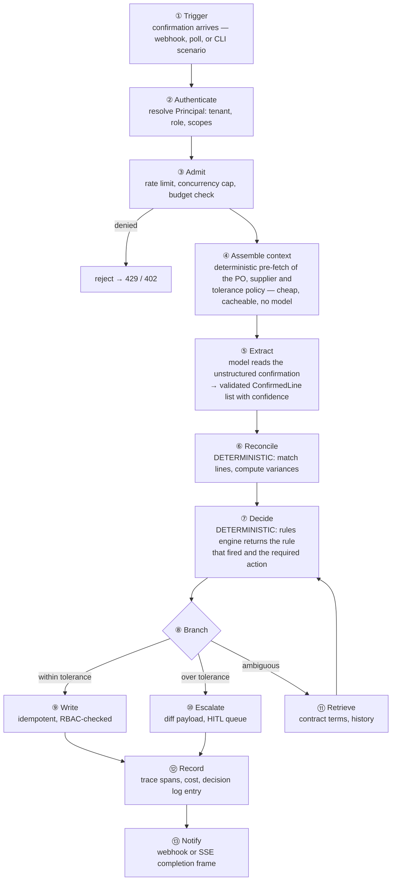

# Architecture

> Status: specification. Modules are marked with the phase in which they first exist. See [FOREMAN_SPEC.md](FOREMAN_SPEC.md) §10 for phase definitions.

This document explains how Foreman is put together and, more importantly, where the seams are. The layer diagram is in [FOREMAN_SPEC.md](FOREMAN_SPEC.md) §4; this document explains why each boundary is where it is.

## Table of contents

1. [The organising principle](#1-the-organising-principle)
2. [Layers](#2-layers)
3. [Structural invariants](#3-structural-invariants)
4. [The lifecycle of a run](#4-the-lifecycle-of-a-run)
5. [Data flow and ownership](#5-data-flow-and-ownership)
6. [State and durability](#6-state-and-durability)
7. [Failure model](#7-failure-model)
8. [Extension points](#8-extension-points)

---

## 1. The organising principle

Every component in Foreman is either **deterministic** or **model-driven**, and never quietly both.

This is not stylistic. It has three concrete consequences:

1. **Testability.** A deterministic component has a truth table. You assert on it. A model-driven component has a distribution; you assert on properties and bound the damage.
2. **Auditability.** "The system escalated because rule `PRICE_TOL_V3` fired at 4.2% over a 3% band" is an answer. "The model thought it looked high" is not.
3. **Cost.** Inference is the expensive operation. Every decision moved into the deterministic core is a decision that costs nothing and cannot drift.

The split is roughly 80/20 by volume of code and by number of decisions. It is close to inverted by attention in most agent projects, which is the gap this repository is built to demonstrate.

### What belongs where

| Deterministic | Model-driven |
| --- | --- |
| Tolerance comparison | Extracting a price from a PDF table |
| Spend threshold and approval routing | Deciding whether two supplier names are the same entity |
| Three-way match | Classifying a document type |
| Idempotency key derivation | Summarising a conflict for a human reviewer |
| Retry classification | Choosing which tool to call next |
| ACL filtering | Ranking retrieved passages by relevance |
| Write authorisation | Drafting the escalation message |

The test for which side something belongs on: **can two competent people, given the same inputs and the policy document, disagree about the correct answer?** If not, it is a rule, and putting it in a prompt is a bug.

---

## 2. Layers

Six layers, each depending only on layers below it. The dependency direction is enforced by an import-linting rule in CI.

### 2.1 Service layer — `api/`

The only layer that knows about HTTP, authentication tokens, streaming and tenants-as-request-context. It converts an external request into a `RunRequest` carrying a resolved `Principal`, and converts internal events into SSE frames.

It does **not** contain business logic. If a rule appears in a route handler, it is in the wrong place.

### 2.2 Orchestration layer — `runtime/`, `agent/`

Owns the control loop: what step happens next, when to stop, what the model sees, and what it is allowed to do. Two implementations behind one protocol (see [agent-architecture.md](agent-architecture.md)).

This layer composes the deterministic core and the model layer. It is the only layer permitted to import both.

### 2.3 Deterministic core — `rules/`, `models/`, `mapping/`, `utils/`

Pure functions and validated data. No I/O, no network, no clock reads that are not injected, no model calls. Fully testable without fixtures beyond data.

Because it has no dependencies on anything above it, this layer is where property-based testing pays off — `hypothesis` can generate thousands of purchase orders and assert that the matching function is total and never raises.

### 2.4 Model layer — `providers/`

Everything that talks to an inference endpoint, behind one protocol. Routing, structured output, caching, token accounting and budget enforcement live here so that no caller needs to know whether it just spoke to a 3B model on localhost or a frontier API.

The layer's contract: **a provider returns validated data or raises.** It never returns a string that a caller has to hope is JSON.

### 2.5 Capability layer — `mcp_server/`, `rag/`, `ingestion/`, `security/`, `governance/`

Self-contained capabilities the orchestration layer draws on. Each is usable standalone — the MCP server runs without the agent, the retriever answers queries from a script — which is both a design property and a testing convenience.

### 2.6 Connector layer — `connectors/`

The edge. Everything that speaks to an external system, with all the unpleasantness that implies: pagination, rate limits, token refresh, partial failures, inconsistent field names. Isolated here so the rest of the system can pretend the world is tidy.

---

## 3. Structural invariants

Five rules that CI enforces, because an architecture that relies on discipline alone decays.

| # | Invariant | Enforced by |
| --- | --- | --- |
| 1 | No module imports both `rules/` and `providers/` except `runtime/` | Import-linter contract |
| 2 | Every model output crosses a Pydantic boundary before reaching a rule, a tool argument or a write | Type checking + `providers/structured.py` returning typed models only |
| 3 | Every write tool is authorised by `security/rbac.py` at dispatch | Tool registry refuses to register a `mutates=True` tool without a declared required scope |
| 4 | `rules/` and `models/` import nothing from `agent/`, `api/`, `connectors/` or `providers/` | Import-linter contract |
| 5 | Every mutating connector call carries an idempotency key | Connector base class requires it in the signature |

Invariant 3 is the one that matters most. It means the answer to "what if the model is tricked into confirming a $2M order?" is not "the prompt says not to" — it is "the tool dispatch rejected it, and there is a trace of the attempt."

---

## 4. The lifecycle of a run

Steps ④, ⑥, ⑦, ⑨ and ⑫ involve no inference at all. Steps ⑤ and ⑪ are the only places a model is load-bearing, and both are bounded: extraction is validated against a schema, retrieval is cited.

### Where humans enter

At ⑩ only. A run that escalates persists its full state, emits a review item and stops. When a reviewer approves, the run resumes from the checkpoint with the decision injected as an observation — it does not restart, and it does not re-extract. On the graph runtime this is `interrupt()` and `Command(resume=...)`; on the native runtime it is a serialised `AgentState` reloaded from the run store.

---

## 5. Data flow and ownership

### Source of truth is per field, not per system

The naive design nominates one system as authoritative. Reality does not cooperate: the ERP owns the contractual price, the portal owns what the supplier actually confirmed, the logistics system owns the real delivery date, and the CRM owns which contract applies.

`connectors/resolver.py` holds a field-level registry:

| Field | Authoritative system | Conflict behaviour |
| --- | --- | --- |
| `unit_price` | ERP (contract price) | Portal disagreement → variance, evaluated by rules |
| `confirmed_quantity` | Portal | ERP disagreement → data-quality flag, escalate |
| `promised_date` | Portal | Logistics ASN disagreement → surface both, prefer ASN if later and shipped |
| `contract_ref` | CRM | Missing → block confirmation, cannot evaluate tolerance |
| `received_quantity` | ERP goods receipt | — |

**Conflicts are surfaced, never silently resolved.** A conflict is a first-class value in the returned object, not a logged warning. The rules engine decides what a conflict means; the resolver only reports it.

### The trace is the other product

Every run emits an append-only trace covering every step, every tool call and every rule evaluation. This is not logging. Three consumers depend on it:

- **The reviewer** — needs to see why, in seconds, to approve or reject.
- **The warehouse** — turns traces into KPIs (`obs/warehouse.py`).
- **The evaluation suite** — golden traces are recorded runs replayed as assertions.

Because the third consumer exists, the trace schema is versioned and breaking changes to it are treated as breaking changes to the product.

---

## 6. State and durability

Four categories of state, with different durability requirements. Conflating them is the most common source of "it worked until we restarted it."

| State | Lives in | Durability | Lifetime |
| --- | --- | --- | --- |
| Conversation / context window | Assembled per step, never stored raw | None — rebuildable | One step |
| Working state | `AgentState`, checkpointed | Must survive restart | One run, or until review completes |
| Run history | Run store (SQLite → Postgres) | Durable | Retention window |
| Knowledge | Vector index, graph, warehouse | Durable, rebuildable from source | Until source deleted |

The rule: **anything that cannot be rebuilt must be checkpointed; anything that can be rebuilt should not be stored.** The context window is rebuilt from working state on every step, which is what makes summarisation safe — you are compacting a projection, not destroying the record.

Detail: [memory.md](memory.md).

---

## 7. Failure model

Failures are classified before they are handled. The taxonomy in `core/errors.py` is the vocabulary the whole system uses.

| Class | Examples | Handling |
| --- | --- | --- |
| `TransientError` | 429, 502, connection reset, provider timeout | Retry with backoff and jitter, honour `Retry-After`, circuit-break after a threshold |
| `PermanentError` | 400, 404, schema mismatch, missing contract reference | Fail fast, no retry, escalate with context |
| `ToolError` | Invalid arguments, precondition unmet | Returned to the model with a `suggestion` so it can self-correct — bounded by the step ceiling |
| `PolicyViolation` | Write over ceiling, missing scope, injection detected | Hard stop, audit entry, never retried, never surfaced to the model as a correctable error |
| `BudgetExceeded` | Per-run or daily cost ceiling | Hard stop before the call is made |

The distinction between `ToolError` and `PolicyViolation` is deliberate. A `ToolError` is a conversation with the model — wrong arguments, try again. A `PolicyViolation` is not negotiable and is never phrased as advice, because a model told "you lack the `write:orders` scope" will attempt to acquire it.

### Degradation ladder

Each optional dependency has a defined fallback, and the fallback is tested.

| Unavailable | Falls back to | Visible effect |
| --- | --- | --- |
| Frontier provider | Local SLM via router | Lower extraction confidence → more escalations |
| Ollama | Mock provider (dev) or hard fail (prod profile) | Explicit, never silent |
| Neo4j | In-memory graph | Slower multi-hop, same answers on the sample corpus |
| pgvector | In-memory numpy index | Bounded corpus size |
| Langfuse | Append-only JSONL trace | No dashboard, full local trace |
| Run store (Postgres) | SQLite | Single-node only |

**A dropped trace is never acceptable.** Observability degrading silently is how silent errors become invisible, which is the one failure mode this project is built to prevent.

---

## 8. Extension points

The interfaces intended to be implemented against, listed so that a reader can see the shape of the system without reading it all.

| Protocol | Purpose | Implementations |
| --- | --- | --- |
| `Runtime` | An agent execution engine | `native`, `langgraph` |
| `LLMProvider` | Inference | `mock`, `local`, `openai_compat`, `anthropic`, `google` |
| `Connector` | An external system | `erp`, `crm`, `portal`, `logistics` |
| `AuthStrategy` | Connector authentication | `api_key`, `oauth`, `service_account` |
| `VectorIndex` | Dense retrieval | `numpy`, `pgvector` |
| `GraphStore` | Entity graph | `memory`, `neo4j` |
| `TraceSink` | Span export | `jsonl`, `otel`, `langfuse` |
| `Guardrail` | Input/output/action check | Several, composed in order |

Adding a fifth connector should require implementing `Connector` and `AuthStrategy`, registering field ownership in the resolver, and nothing else. If it requires touching `runtime/`, the abstraction is wrong.
