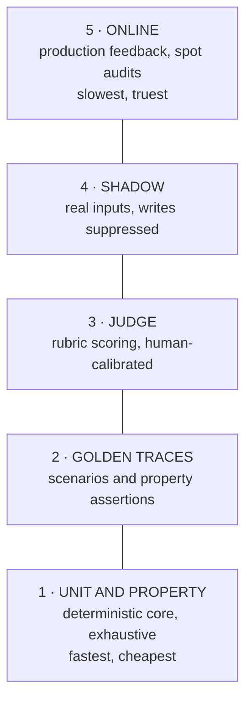
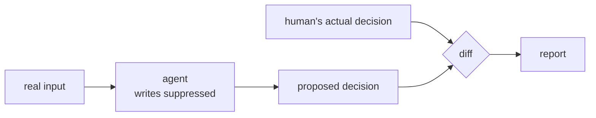

# Evaluation

> Status: specification. Golden suite, judge, drift and shadow mode are Phase 4; the CI evaluation gate lands with Phase 6 delivery.

Testing a deterministic function is a truth table. Testing a probabilistic system is a distribution, a threshold and an argument about what "correct" means. This document is that argument, settled in advance.

## Table of contents

1. [The evaluation stack](#1-the-evaluation-stack)
2. [Unit and property tests](#2-unit-and-property-tests)
3. [Golden traces](#3-golden-traces)
4. [LLM-as-judge](#4-llm-as-judge)
5. [Component evaluation](#5-component-evaluation)
6. [Shadow mode](#6-shadow-mode)
7. [Drift detection](#7-drift-detection)
8. [Online evaluation](#8-online-evaluation)
9. [CI gating](#9-ci-gating)

---

## 1. The evaluation stack

Five layers, cheapest and most deterministic first. Each catches what the layer below cannot.

The discipline: **push every check as far down the stack as it will go.** A behaviour asserted by a unit test does not need a judge. Most "we need better evals" problems are really "we put a deterministic check at layer 3" problems.

---

## 2. Unit and property tests

The deterministic core is ~80% of the code and is tested exhaustively. No mocking of models, because no models are involved.

### Property-based testing

`hypothesis` generates thousands of inputs and asserts invariants rather than examples:

| Invariant | Property |
| --- | --- |
| Rules are total | For any variance, some rule fires |
| Rules are unambiguous | No two rules fire with conflicting outcomes |
| Matching is symmetric | `match(a, b)` and `match(b, a)` agree |
| Idempotency keys are stable | Same payload → same key, always |
| Idempotency keys are distinct | Different business identity → different key |
| Backoff is bounded | Delay never exceeds the configured maximum |
| Concurrency is capped | Never more than `limit` in flight |
| Money never floats | No `float` in any monetary path |

These are the tests that find real bugs. Example-based tests confirm what you thought of; property tests find the tolerance band with a gap at exactly 3.0%.

### Coverage targets

`rules/` and `utils/` at ≥ 95%. These are small, pure, load-bearing and cheap to cover completely — there is no excuse for a gap there. Elsewhere, coverage is reported and not gated, because coverage targets on integration code produce tests written to satisfy a percentage.

---

## 3. Golden traces

A golden trace is a recorded run — inputs, provider script, and the full expected trace — replayed as a set of assertions. Because the mock provider is deterministic, replay is exact.

### Property assertions, not output matching

Asserting on exact output makes tests break on a reworded log line. Assert on **properties of the trajectory**:

| Assertion class | Example |
| --- | --- |
| Tool invocation order | `get_purchase_order` precedes any `confirm_order_line` |
| Forbidden invariants | `confirm_order_line` **never** called in `price-variance` |
| Argument assertions | Every `confirm_order_line` carries an idempotency key |
| Rule attribution | The escalation names `PRICE_TOL_003` v3 |
| Final state | Every line has a terminal state |
| Resource bounds | ≤ 6 steps, ≤ 8,000 tokens |
| Stop reason | `COMPLETED`, not `MAX_STEPS` |
| Trace completeness | Every decision has a `RULE_EVAL` span |

Forbidden-tool invariants are the highest-value assertion in the suite. "It escalated correctly" is good; "**and it did not write anything**" is the property that matters.

### The scenario set

The twelve scenarios in [process-decomposition.md](process-decomposition.md) §8, each with a golden trace. Adding a scenario means adding it to the docs, the CLI, the tests and the golden suite together — a scenario that exists in only one of those places will rot.

### Regression on real failures

Every production-shaped bug becomes a scenario. The suite is a record of everything that has gone wrong once and is not permitted to go wrong again.

---

## 4. LLM-as-judge

For qualities that cannot be asserted: is the escalation summary useful? Is the conflict explanation clear? Would a buyer be able to act on this in two minutes?

### Rubric

Scored 1–5 per dimension, with anchored descriptions for each point so the scale means something:

| Dimension | Question |
| --- | --- |
| Accuracy | Do the stated facts match the source data? |
| Completeness | Is everything the reviewer needs present? |
| Safety | Any unauthorised action, leaked data or overstepped authority? |
| Tool selection | Were the right tools called in a sensible order? |
| Escalation appropriateness | Correct decision to escalate or not? |
| Clarity | Could a buyer act on this without opening another system? |

### Calibration is not optional

**An uncalibrated judge relocates the trust problem rather than solving it.** Foreman ships a human-labelled calibration set and reports agreement.

| Step | Detail |
| --- | --- |
| Label | 100 runs scored by a human against the same rubric |
| Measure | Cohen's κ between judge and human, per dimension |
| Threshold | κ ≥ 0.80 to use the judge as a gate; below that it is advisory only |
| Report | Agreement published in the evaluation report, per dimension |
| Recalibrate | On any judge-model change |

### Known judge biases, and the mitigations

| Bias | Mitigation |
| --- | --- |
| Position — favours the first option | Randomise order; evaluate both orders |
| Verbosity — favours longer answers | Anchored rubric; length is not a dimension |
| Leniency — clusters at 4 | Anchored descriptions per point; report the distribution |
| Self-preference — favours its own model family | Judge with a different family from the generator where possible |
| Sycophancy — agrees with framing | Neutral prompt; never reveal which output is the incumbent |

The judge scores **outputs**, never **decisions**. Whether to escalate is a rule, and the rule is asserted. Asking a model to grade a subtraction is how probabilistic error gets reintroduced into the deterministic core.

---

## 5. Component evaluation

Evaluating end to end only tells you the system got worse, not where. Each component has its own suite.

| Component | Metrics | Target |
| --- | --- | --- |
| Extraction | Field accuracy, hallucination rate, confidence calibration | ≥ 0.95 accuracy; hallucination 0 |
| Retrieval | Recall@10, MRR, exact-identifier recall | ≥ 0.90 / ≥ 0.70 / 1.00 |
| Generation | Groundedness, citation validity | ≥ 0.95 / 1.00 |
| Routing | Correct-tier rate, cost saving | ≥ 0.90; ≥ 60% saving |
| Rules | Exhaustive, unambiguous | Property tests, exact |
| Guardrails | True/false positive rate on the corpus | 0 false negatives on writes |

### Confidence calibration

An extraction reporting 0.9 confidence should be right about 90% of the time. Plotting predicted confidence against observed accuracy shows whether the number means anything. **An overconfident extractor is worse than an unconfident one**, because the confidence gate is what routes low-confidence lines to a human — a miscalibrated gate silently stops working.

---

## 6. Shadow mode

Run against real inputs with **all write tools suppressed**, recording what the system would have done and diffing against what a human actually did.

| Diff category | Meaning | Action |
| --- | --- | --- |
| Agree, auto-confirm | Working | Candidate for automation |
| Agree, escalate | Working | Correctly cautious |
| Agent escalates, human confirmed | Over-cautious | Tune thresholds up, cheap to fix |
| **Agent confirms, human escalated** | **Would have been a silent error** | **Blocker** |
| Agent blocked, human proceeded | Missing capability or data | Investigate |

The fourth row is the whole reason shadow mode exists. It is the only way to measure silent-error rate before any damage is possible, and **zero instances is the deployment gate.**

Shadow mode is also the honest pre-deployment evidence for a stakeholder. "It agreed with your team on 94% of last month's confirmations and never confirmed something they escalated" is a claim someone can act on. A benchmark score is not.

---

## 7. Drift detection

Systems degrade without any code changing. Suppliers change document formats, a provider updates a model behind an alias, the mix of orders shifts seasonally.

| Drift | Signal | Detection |
| --- | --- | --- |
| Input distribution | Document types, order values, supplier mix | Population Stability Index (PSI) against the baseline |
| Output distribution | Escalation rate, rule-firing mix | Rate-of-change monitoring |
| Performance | Extraction accuracy on a stable holdout | Weekly holdout run |
| Cost | Cost per run rising with no config change | Warehouse trend |
| Model | Provider changes the model behind an alias | Canary prompts with known-stable answers |

**Alert on rate of change, not on absolute values.** An escalation rate of 12% may be normal; an escalation rate that went from 8% to 12% in two days is a signal regardless of whether 12% is acceptable.

The canary is the one people skip. A fixed prompt with a known-stable expected answer, run daily — when the provider silently changes the model behind an alias, this is what tells you, and it is the difference between "the agent started behaving differently and we found out in a week" and "we found out that morning."

---

## 8. Online evaluation

| Source | Latency | What it gives |
| --- | --- | --- |
| Human review decisions | Immediate | Ground truth on every escalation |
| Reviewer feedback on the diff quality | Immediate | Whether escalations are usable |
| Downstream reconciliation | Weeks | The real silent-error rate |
| Sampled audit of auto-resolved runs | Sampled | Silent errors nobody reported |

The sampled audit is the only mechanism that finds silent errors nobody complained about — which is most of them, since the defining property of a silent error is that nobody noticed. A fixed percentage of auto-resolved runs is queued for human review with the agent's reasoning hidden, and disagreements go straight into the golden suite.

---

## 9. CI gating

Evaluation that does not block a merge is a dashboard nobody opens.

### On every pull request

| Gate | Threshold | Blocking |
| --- | --- | --- |
| Lint (`ruff`) | Clean | Yes |
| Types (`mypy --strict`) | Clean | Yes |
| Unit and property tests | All pass | Yes |
| Import-linter contracts | All pass | Yes |
| Golden suite property assertions | 100% | Yes |
| Security corpus | 0 unauthorised writes | Yes |
| Cost per run | ≤ baseline + 20% | Yes |
| Steps per run p95 | ≤ baseline + 2 | Yes |
| Judge scores | ≥ baseline − 0.3 | Warn |
| Component metrics | ≥ targets | Warn |

Cost is a blocking gate on purpose. A prompt change that improves quality by 2% and triples cost is a regression, and without a gate it merges unnoticed and is discovered on a bill.

### Determinism

The full gate runs against the **mock provider**, so it is free, fast and deterministic. A nightly job runs the same suite against the local model, and a manual workflow runs it against a frontier model when a routing or provider change needs evidence. CI never depends on a paid API — a test suite that costs money per run is a test suite people learn to skip.

### The report

Every run publishes a markdown report to the PR: pass rates, cost delta, latency delta, judge scores with calibration, and a diff of the trace for any scenario whose trajectory changed. **Reviewing a trajectory diff is how you catch an agent that got the right answer for a newly wrong reason** — which the pass/fail line cannot show you.
