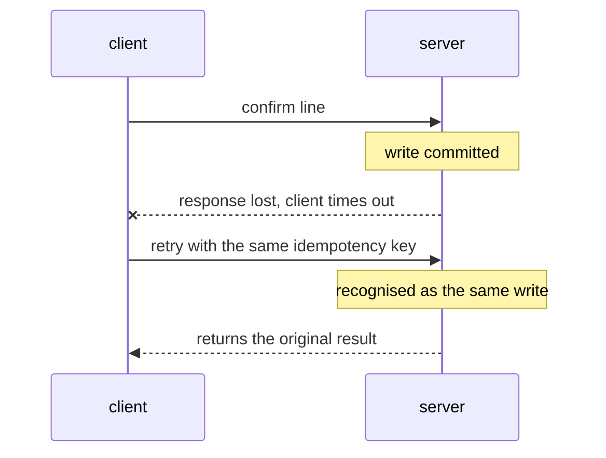

# Enterprise Integration

> Status: specification. Connectors, auth strategies, resolver and mapping are Phase 2.

Four mock enterprise systems, four authentication patterns, and the machinery that keeps writes safe when the network misbehaves. This is the layer where most agent projects quietly fail, because the demo used one clean API and production has four dirty ones.

## Table of contents

1. [The systems](#1-the-systems)
2. [Connector contract](#2-connector-contract)
3. [Authentication patterns](#3-authentication-patterns)
4. [Source of truth per field](#4-source-of-truth-per-field)
5. [Schema mapping](#5-schema-mapping)
6. [Write safety](#6-write-safety)
7. [Resilience](#7-resilience)
8. [Data flow patterns](#8-data-flow-patterns)
9. [Testing integrations](#9-testing-integrations)

---

## 1. The systems

Mocks, but with the frictions that make integration work real. Each one is deliberately awkward in a different way, and each one demonstrates a different auth pattern.

| System | Owns | Auth | Deliberate friction |
| --- | --- | --- | --- |
| **ERP** | Purchase orders, goods receipts, invoices | Service account with a long-lived signed assertion | Cursor pagination, optimistic locking via `version`, 5xx under load, 30-field records where 6 matter |
| **CRM** | Suppliers, contacts, contract references | OAuth 2.1 client credentials | Short-lived tokens, `snake_case` where the ERP uses `camelCase`, soft deletes that still return |
| **Procurement portal** | Confirmations, catalogue, price lists | API key in a header | Aggressive rate limiting with `Retry-After`, eventual consistency after writes, prices as strings |
| **Logistics / WMS** | Shipments, ASNs, delivery events | Delegated user token with refresh | Webhook delivery, out-of-order events, at-least-once semantics, timestamps in local time without a zone |

The divergence is the point. If all four spoke the same dialect, `mapping/` would be pointless and the resolver would be a lookup table.

### The realistic detail that costs the most time

`portal` returns `"unit_price": "1234.56"` as a string in the supplier's locale; the ERP returns `unitPrice: 1234.56` as a float in minor units. Comparing a tolerance across those two formats needs three things: a `Decimal` conversion, a currency check and a units check. A model should not be doing any of them. All three belong in the connector, as it converts the response.

---

## 2. Connector contract

```python
class Connector(Protocol):
    name: str
    auth: AuthStrategy

    async def get(self, resource: str, **params) -> Projected: ...
    async def list(self, resource: str, **params) -> AsyncIterator[Projected]: ...
    async def mutate(
        self, resource: str, payload: BaseModel, *, idempotency_key: str
    ) -> MutationResult: ...
    async def health(self) -> HealthStatus: ...
```

Four properties the base class enforces so that no individual connector can forget them:

**Projection at the edge.** A connector returns domain models, never raw payloads. The 30-field ERP record becomes a `PurchaseOrder`. Nothing above this layer knows the source system's field names, which is what makes a fifth connector cheap.

**`idempotency_key` is required on `mutate`.** Not optional, not defaulted — a missing key is a type error caught by `mypy`, not a runtime surprise discovered after a duplicate write.

**`list` returns an async iterator.** Pagination is the connector's problem. Callers iterate; they never see a cursor.

**Every call is traced.** Duration, status, retry count and rate-limit headers land in the trace as a span. When the p95 moves, the answer is in the trace, not in a guess.

---

## 3. Authentication patterns

One per connector, so all four are exercised by the test suite rather than described in a comment.

### 3.1 API key — the portal

Simplest and most commonly mishandled.

- Stored hashed; the plaintext exists only in the environment at load.
- Sent in a header, never a query string — query strings land in access logs, proxies and browser history.
- Redacted by `security/masking.py` before any log or trace write, matched by pattern rather than by variable name so a key in an error body is caught too.
- Rotation supported by accepting two valid keys during an overlap window.

### 3.2 OAuth 2.1 client credentials — the CRM

Machine-to-machine, no user present.

```text
  POST /token   grant_type=client_credentials
                scope=suppliers:read contracts:read
       ──────▶  access_token, expires_in=3600
```

- Scopes requested are the minimum the connector needs, not everything available.
- Tokens cached in memory keyed by scope set, refreshed at 80% of lifetime rather than on expiry, so no request pays the refresh latency.
- Client secret never leaves the process; never logged, never traced.

### 3.3 Service account — the ERP

A non-human identity with its own permissions, distinct from any user's.

- The agent acts as itself, not as the user. The user's authority is checked at the API boundary by `security/rbac.py`; the connector's authority is separate and narrower.
- This is what makes "the agent could not have done that even if the user asked" a true statement — the service account simply lacks the permission.
- Credentials sourced from the environment or a secret manager, never from configuration files in the repository.

### 3.4 Delegated token with refresh — logistics

A user-delegated token that expires, with a refresh token.

The interesting part is the **single-flight refresh**. Twenty concurrent calls discovering an expired token must not trigger twenty refreshes — most providers invalidate the previous refresh token on use, so the naive version produces nineteen failures and a revoked session.

```python
async def token(self) -> str:
    if self._fresh():
        return self._access
    async with self._refresh_lock:          # one waiter refreshes
        if self._fresh():                   # others re-check after waking
            return self._access
        self._access = await self._refresh()
    return self._access
```

The second check inside the lock is not there for show. Without it, every waiter refreshes in turn after acquiring the lock, which is the bug the lock was added to prevent.

### Comparison

| Pattern | Identity | Expiry | Use when |
| --- | --- | --- | --- |
| API key | The application | None — rotated | Simple server-to-server, low sensitivity |
| Client credentials | The application | Short | Machine-to-machine with scopes |
| Service account | A named non-human principal | Long, rotated | The agent needs its own audited identity |
| Delegated + refresh | A user, via the application | Short + refresh | Acting on behalf of a person |

---

## 4. Source of truth per field

The naive design nominates one system as authoritative. Reality is not that simple.

`connectors/resolver.py` holds a field-level registry:

| Field | Authority | Second opinion | On disagreement |
| --- | --- | --- | --- |
| `unit_price` | ERP (contract price) | Portal (confirmed price) | This *is* the variance — evaluate against tolerance |
| `confirmed_quantity` | Portal | ERP order quantity | Difference is the decision, not an error |
| `promised_date` | Portal | Logistics ASN | ASN wins if later **and** the shipment has departed |
| `contract_ref` | CRM | — | Missing → block; tolerance cannot be evaluated |
| `received_quantity` | ERP goods receipt | Logistics delivery event | Disagreement → data-quality flag, escalate |
| `supplier_status` | CRM | — | Inactive supplier → block confirmation |

### Conflict is a value, not an exception

```python
class Resolved(BaseModel, Generic[T]):
    value: T
    source: str
    conflicts: list[SourceConflict] = []
    confidence: float = 1.0
```

A conflict is returned in the result, not logged as a warning. The resolver's job is to **report** disagreement; the rules engine decides what it means. That separation is why "the portal and the ERP disagree on price" can be a normal business variance in one context and a data-quality incident in another, without the resolver needing to know which.

**Nothing is silently reconciled.** The moment a resolver picks a winner without recording that it did, the audit trail is fiction.

---

## 5. Schema mapping

Mapping between systems is where confident automation causes the most damage, because a wrong mapping is wrong for every record that follows.

`mapping/schema_mapper.py` produces **candidates with scores**, never a blind transform:

```python
class FieldMapping(BaseModel):
    source_field: str
    target_field: str
    confidence: float          # how likely this pairing is correct
    weight: float              # how much a mistake here costs
    evidence: list[str]        # name similarity, type match, value overlap, samples
    transform: str | None      # "string_to_decimal", "local_to_utc"
    requires_review: bool      # derived: confidence low OR weight high
```

Two scores, because they answer different questions. `confidence` is how sure the mapper is. `weight` is how much it matters — mapping `unit_price` wrong is catastrophic, mapping `notes` wrong is untidy. **Review is required when confidence is low or weight is high**, so a high-confidence mapping of a financial field still gets human eyes.

`mapping/review.py` renders a report a human accepts or rejects **per field**, and the accepted mapping is stored with a version. The mapper proposes; a person disposes; the system remembers.

---

## 6. Write safety

Every mutation is idempotent. Not most — every one.

### Deterministic keys

```text
  key = sha256(tenant | operation | business_identity | normalised_payload | time_bucket)
```

Derived from the **business payload**, not from a counter, a UUID or a timestamp. That is what makes it survive a process restart: a resumed run recomputes the identical key, so the retry is recognised as the same write rather than a new one.

The time bucket (hourly by default) bounds the dedupe window. Without it, a legitimate identical write six months later is silently swallowed.

### The case this exists for



The write succeeded and the client does not know. Without idempotency the retry double-confirms; with it, the second call returns the first call's result. This is not an edge case — it is the normal behaviour of networks under load.

### Layers

| Layer | Mechanism |
| --- | --- |
| Key derivation | Deterministic over the business payload |
| Dedupe store | Key → result, TTL-bounded, checked before dispatch |
| Provider support | `Idempotency-Key` header where the system honours it |
| Read-before-write | For systems that do not, verify current state first |
| Optimistic concurrency | `version` / `If-Match` where available; conflict → re-read and re-evaluate, never blind overwrite |
| Value ceiling | Enforced by `security/rbac.py` before dispatch, independent of everything above |

---

## 7. Resilience

### Error classification comes first

Retrying the wrong error wastes budget and, worse, hides a permanent fault behind a slow failure.

| Condition | Class | Action |
| --- | --- | --- |
| Connection error, timeout | Transient | Retry with backoff |
| 429 | Transient | Retry, **honour `Retry-After`** |
| 500, 502, 503, 504 | Transient | Retry with backoff |
| 400, 422 | Permanent | Fail immediately — the payload is wrong and will stay wrong |
| 401 | Auth | Refresh once, then fail |
| 403 | Permanent | Fail; a scope problem is not a network problem |
| 404 | Permanent | Fail, escalate with context |
| 409 | Conflict | Re-read, re-evaluate, retry once |

### Backoff with jitter

Exponential backoff with full jitter. Without jitter, every client that failed during an outage retries in lockstep and re-creates the outage the moment the service recovers.

`Retry-After` always wins over the computed delay. A server that tells you when to come back has more information than your backoff formula.

### Circuit breaker

Three states: closed, open, half-open. After a failure threshold the breaker opens and calls fail fast for a cool-down period; one probe then decides whether to close.

An open breaker also **withdraws that connector's tools** from the registry and emits `notifications/tools/list_changed`, so the agent stops choosing a tool that cannot work instead of burning steps discovering it.

### Bounded concurrency with isolation

```python
results = await bounded_gather(
    *(confirm(line) for line in order.lines),
    limit=5,
    return_exceptions=True,
)
```

Two guarantees: never more than `limit` concurrent calls to one system, and **one failed line does not fail the run**. Per-item isolation is what turns "the run crashed" into "four lines confirmed, one escalated" — which is the difference between a system people trust and one they turn off.

---

## 8. Data flow patterns

| Pattern | Used for | Trade-off |
| --- | --- | --- |
| **Pull, on demand** | PO lookup during a run | Simple, always fresh, latency on the critical path |
| **Pull, scheduled** | Catalogue and price-list sync | Predictable load, bounded staleness |
| **Push, webhook** | Confirmations, delivery events | Low latency; needs signature verification, replay protection and out-of-order handling |
| **Batch** | Nightly reconciliation | Efficient, high latency, needs a restartable checkpoint |

### Webhook handling

At-least-once delivery is the contract, so the receiver does the work:

- **Verify the signature** before parsing the body. An unsigned webhook is an unauthenticated write endpoint.
- **Deduplicate by event ID.** The same event will arrive twice.
- **Handle out-of-order arrival.** A `shipment.delivered` can precede `shipment.dispatched`; sequence by event timestamp, not arrival order.
- **Acknowledge fast, process asynchronously.** Return 200, enqueue, work. A slow handler causes retries, which causes duplicates, which causes load.

Sync versus async boundaries across the whole system: [scalability.md](scalability.md).

---

## 9. Testing integrations

| Level | Approach |
| --- | --- |
| Unit | Connector logic against recorded fixtures |
| Contract | Response fixtures validated against the schema the connector expects; a changed shape fails here, not in production |
| Fault injection | Timeouts, 429 with `Retry-After`, 500 bursts, malformed bodies, truncated pages |
| Idempotency | Simulated timeout-after-success, asserting exactly one write |
| Concurrency | Twenty parallel calls with an expired token, asserting exactly one refresh |
| Pagination | Cursor loops, missing `nextCursor`, a cursor that never terminates |
| Resolver | Every conflict row in §4 |
| Auth | Expiry mid-run, refresh failure, rotated key overlap |

The fault-injection suite is what makes the resilience claims real. Retry logic that has never been tested against an actual 429 is a hypothesis.
