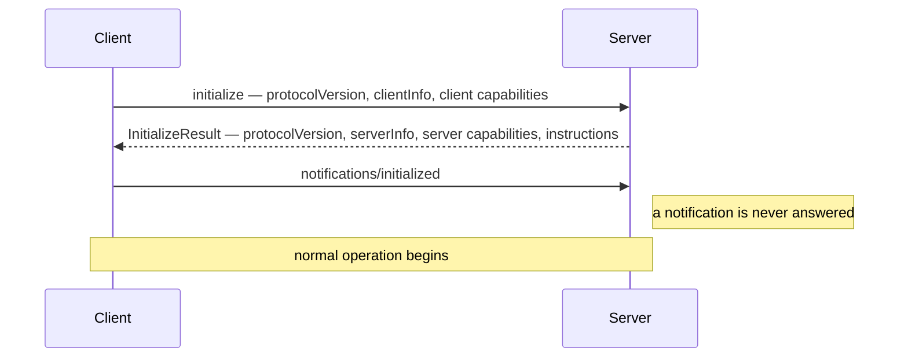
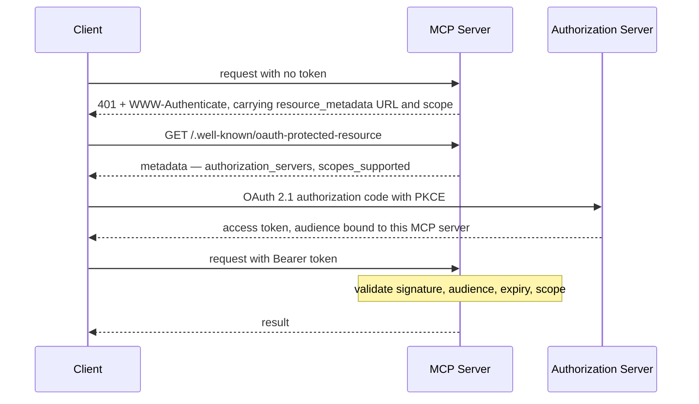

# Model Context Protocol

> Status: specification. Core server, stdio transport and client are Phase 2; Streamable HTTP, authorization and tasks are Phase 5.
> Target protocol revision: **2025-11-25**. Foreman negotiates the revision at initialise and refuses to guess.

MCP is the interface between an agent and the systems it acts on. Foreman implements **both sides** — a hand-rolled server, because the wire format is the lesson, and an SDK-based client, because consuming third-party servers is the realistic case.

## Table of contents

1. [Why both sides](#1-why-both-sides)
2. [Base protocol](#2-base-protocol)
3. [Lifecycle and capability negotiation](#3-lifecycle-and-capability-negotiation)
4. [Server features](#4-server-features)
5. [Client features](#5-client-features)
6. [Utilities](#6-utilities)
7. [Transports](#7-transports)
8. [Authorization](#8-authorization)
9. [Threat model](#9-threat-model)
10. [Foreman's server surface](#10-foremans-server-surface)
11. [Foreman as a client](#11-foreman-as-a-client)
12. [Testing](#12-testing)

---

## 1. Why both sides

| Side | Implementation | Reason |
| --- | --- | --- |
| **Server** | Hand-rolled over JSON-RPC 2.0 | Framing, lifecycle, capability negotiation and error semantics are the subject. An SDK hides exactly the parts worth understanding. |
| **Client** | Official SDK | Connecting to servers you did not write is the realistic enterprise case, and reimplementing a client teaches nothing the server did not. |

Both sides in one repository means the tests can drive a real conversation over a real transport rather than mocking the protocol away.

---

## 2. Base protocol

JSON-RPC 2.0. Three message shapes, and the difference between them matters.

| Shape | Has `id` | Expects a reply | Example |
| --- | --- | --- | --- |
| Request | Yes | Yes | `tools/call` |
| Response | Matches request | — | Result or error |
| Notification | No | **No** | `notifications/initialized` |

The most common implementation bug is replying to a notification, which corrupts the stream for everything after it. Foreman's dispatcher makes it impossible: notification handlers return `None` and the framing layer refuses to serialise a response without an `id`.

### Errors

Standard JSON-RPC codes for protocol faults; **tool execution failures are not protocol errors**.

| Situation | Encoding |
| --- | --- |
| Unknown method | JSON-RPC error `-32601` |
| Malformed arguments | JSON-RPC error `-32602` |
| Tool ran and failed | Successful response with `isError: true` in the result |

That distinction exists so the model can see and correct a tool failure. A protocol error is for the client; a tool error is for the agent. Collapsing them means either the model never learns the call failed, or transport bugs get fed to the model as if they were correctable.

---

## 3. Lifecycle and capability negotiation



**Nothing may be sent before `initialize` completes** except pings. Foreman's server enforces this with a state machine and returns an error for out-of-order requests rather than working by accident.

Capability negotiation is the mechanism that makes the protocol extensible without versioned chaos. Each side declares what it supports; neither may use what the other did not declare.

```json
{
  "capabilities": {
    "tools":     { "listChanged": true },
    "resources": { "subscribe": true, "listChanged": true },
    "prompts":   { "listChanged": true },
    "logging":   {},
    "completions": {}
  }
}
```

If the client declared no `elicitation` capability, the server must not attempt an elicitation. Foreman asserts this in tests, because "it worked against the one client I tried" is the usual standard and it is not good enough.

---

## 4. Server features

Three primitives, distinguished by **who controls them** — which is the design insight that makes MCP more than a plugin API.

| Primitive | Controlled by | Analogy | Side effects |
| --- | --- | --- | --- |
| **Resources** | The application | A file the host chooses to attach | None — reads must be safe |
| **Prompts** | The user | A slash command the user invokes | None |
| **Tools** | The model | A function the model decides to call | Yes, and that is the point |

### 4.1 Tools

`tools/list` (cursor-paginated) and `tools/call`. Each tool declares a name, a human-readable title, a description, a JSON Schema `inputSchema`, and optionally an `outputSchema`, `icons`, and annotations describing whether it is read-only, destructive or idempotent.

Foreman's server generates schemas from Python type hints via the same registry the agent uses, so a tool cannot be exposed over MCP with a schema that differs from its signature.

`notifications/tools/list_changed` fires when the registry changes — for Foreman that happens when a connector goes into circuit-break and its tools are withdrawn rather than left to fail.

### 4.2 Resources

`resources/list`, `resources/read`, `resources/templates/list`, and optional `resources/subscribe` with `notifications/resources/updated`.

Resources are addressed by URI, and Foreman uses the scheme to encode ownership:

```text
erp://purchase-orders/{po_number}          # templated
erp://tolerance-policy                     # current version
crm://suppliers/{supplier_id}/contracts
portal://confirmations/{confirmation_id}
logistics://shipments/{shipment_id}
```

**Reading must never change anything.** A resource read that writes is a protocol violation. In practice it shows up as mysterious writes appearing when the host application pre-loads resources to populate a picker.

### 4.3 Prompts

`prompts/list` and `prompts/get`. User-initiated templates, with typed arguments and completion support. Foreman exposes `review_supplier_confirmation`, which assembles a reviewer-facing prompt from a PO number — the same assembly the HITL queue uses, so the human path and the model path cannot drift.

### 4.4 Completion

`completion/complete` offers argument autocompletion for prompt and resource-template arguments — typing a partial PO number suggests real ones. Small feature, disproportionate effect on whether a human uses the server twice.

---

## 5. Client features

The inversion that makes MCP interesting: **the server can ask the client for things.** Each is gated on a declared client capability.

### 5.1 Sampling — `sampling/createMessage`

The server requests an LLM completion **from the client**, rather than holding its own API key.

- **Why it matters**: a server can use inference without credentials, without a provider dependency and without the operator paying for a model they did not choose.
- **The rule**: a human should approve or at least be able to see sampling requests. A server that can silently invoke the client's model is a server that can spend the client's money.
- **Foreman's use**: summarising a long contract clause during a resource read, where the summary is better produced by the caller's model than by an extra hop.

### 5.2 Roots — `roots/list`

The client tells the server which URI boundaries it may operate within, with `notifications/roots/list_changed` when they change.

- **Why it matters**: scope confinement declared by the client rather than assumed by the server.
- **Foreman's use**: constraining a document-ingestion server to a tenant's corpus root, so a path-traversal bug cannot reach another tenant's files.

### 5.3 Elicitation — `elicitation/create`

The server asks the **user** for information mid-operation, via the client. The 2025-11-25 revision supports two modes, declared separately in the client's capability object: `form` (structured input against a schema) and `url` (direct the user to complete something out of band).

- **Why it matters**: it removes the worst pattern in tool design — demanding every possible parameter up front because there is no way to ask later.
- **Foreman's use**: a confirmation references an unknown supplier contact; rather than failing or guessing, the server elicits the contact from the operator with a schema-typed form. `url` mode covers re-authorisation flows.
- **The rule**: elicitation must never request credentials. A server asking for a password through a client prompt is a phishing primitive.

---

## 6. Utilities

| Utility | Method / mechanism | Foreman's use |
| --- | --- | --- |
| **Progress** | `_meta.progressToken` on the request, `notifications/progress` back | Bulk reconciliation across 200 POs reports per-PO progress |
| **Cancellation** | `notifications/cancelled` | A user abandoning a run stops the work, not just the stream |
| **Logging** | `logging/setLevel`, `notifications/message` | Server-side diagnostics at a client-chosen level, correlated by run |
| **Pagination** | Opaque `cursor` / `nextCursor` on every list method | Cursors are treated as opaque, never parsed — the client that parses one breaks on the next server version |
| **Tasks** | `tasks/get`, `tasks/list`, `tasks/cancel`; tools declare `execution.taskSupport` | Long-running reconciliation returns a task handle instead of holding a request open |
| **Ping** | `ping` | Liveness on long-lived HTTP sessions |

Tasks are the answer to the operation that outlives its request. Foreman's bulk reconciliation and its human-review escalations are both task-shaped: the work continues, the client polls or reconnects, and cancellation is explicit rather than a dropped connection.

---

## 7. Transports

| | **stdio** | **Streamable HTTP** |
| --- | --- | --- |
| Shape | Subprocess; newline-delimited JSON on stdin/stdout | POST for requests; optional SSE stream for server→client |
| Logs | stderr only — **anything else on stdout corrupts the stream** | Normal logging |
| Auth | Process boundary and environment | OAuth 2.1 bearer tokens |
| Sessions | One process, one session | `Mcp-Session-Id` header, resumable |
| Use | Local tools, development, CI | Remote servers, multi-user, network boundaries |
| Foreman | Phase 2, default | Phase 5 |

Two details that cause most stdio bugs, both enforced in Foreman's implementation:

- **Nothing but protocol messages on stdout.** A stray `print()` in a handler breaks the session in a way that looks like a parser bug three layers away. Foreman's server installs a stdout guard during the session and routes all logging to stderr.
- **Messages are newline-delimited and must not contain embedded newlines.** Pretty-printed JSON is a protocol violation.

For Streamable HTTP, the security requirements are non-negotiable: **validate the `Origin` header** (DNS-rebinding defence), **bind to localhost when running locally**, and authenticate every request. A local HTTP MCP server bound to `0.0.0.0` without origin validation is reachable from any page the user visits.

---

## 8. Authorization

Applies to HTTP transports. stdio uses the process boundary and environment credentials.

**The MCP server is an OAuth 2.1 resource server.** It does not issue tokens; it validates them.

### Discovery



Requirements Foreman implements and tests:

| Requirement | Detail |
| --- | --- |
| Protected Resource Metadata | **Required.** `/.well-known/oauth-protected-resource` names the authorization servers and supported scopes |
| `WWW-Authenticate` on 401 | Carries the `resource_metadata` URL and the required `scope` |
| Audience validation | **The token must have been issued for this server.** A valid token minted for another resource is rejected |
| PKCE | Required on authorization-code flows |
| Client ID Metadata Documents | Recommended; a URL-form `client_id` resolving to a hosted metadata document, validated and cached |
| Dynamic Client Registration | Optional |
| Token passthrough | **Forbidden.** See below |

### No token passthrough

The server must never accept a token and forward it to a downstream service. When Foreman's MCP server calls the ERP connector, it exchanges the caller's identity for its **own** downstream credential and records the delegation in the audit log.

Passing the token through looks convenient, and it breaks four things at once:

- it skips the downstream service's rate limiting and validation
- it destroys accountability, because audit logs no longer show who really acted
- it lets an attacker who compromises one service move sideways into others
- it makes the trust boundary impossible to define

---

## 9. Threat model

MCP's power is that a model can call tools. That is also the entire attack surface.

| Threat | Mechanism | Foreman's control |
| --- | --- | --- |
| **Confused deputy** | The server holds broad credentials and is tricked into using them for a caller who should not have that reach | Per-caller scope enforcement at dispatch; the server's own credentials are never the authorisation decision |
| **Token passthrough** | Caller's token forwarded downstream, bypassing that service's controls | Forbidden; credential exchange with audited delegation |
| **Tool poisoning** | Malicious instructions hidden in a tool's description, read by the model as guidance | Third-party tool descriptions are treated as untrusted content and delimited; descriptions are pinned and hashed |
| **Rug pull** | A server changes a tool's behaviour after approval | Tool definitions hashed at first connect; a changed hash requires re-approval |
| **Indirect prompt injection** | Instructions embedded in a resource the model reads | Untrusted-content delimiting; authorisation never depends on model compliance |
| **Excessive agency** | A tool exposes more capability than the task needs | Narrow tools, `mutates` declared, write ceilings, allow-list per role |
| **Session hijacking** | A predictable or leaked `Mcp-Session-Id` reused | Cryptographically random session IDs bound to the authenticated principal |
| **DNS rebinding** | A web page reaches a locally-bound HTTP MCP server | `Origin` validation, localhost binding, authentication on every request |

The key principle behind all of these: **authorisation is enforced in code at dispatch, never in a prompt.** Every threat above assumes the model can be manipulated. Foreman's controls hold when it has been.

---

## 10. Foreman's server surface

### Tools

| Tool | Mutates | Scope | Notes |
| --- | --- | --- | --- |
| `get_purchase_order` | No | `read:orders` | Projected, not the raw ERP record |
| `get_supplier` | No | `read:suppliers` | From CRM |
| `search_contracts` | No | `read:contracts` | ACL-filtered retrieval, cited |
| `get_shipment` | No | `read:logistics` | ASN and delivery events |
| `confirm_order_line` | **Yes** | `write:orders` | Idempotency key required; value ceiling enforced |
| `escalate_to_buyer` | **Yes** | `write:escalations` | Creates a HITL item with a diff payload |

### Resources

| URI | Content |
| --- | --- |
| `erp://purchase-orders/{po_number}` | Projected purchase order |
| `erp://tolerance-policy` | Current policy with version |
| `erp://tolerance-policy/{version}` | Historical policy, so past decisions stay explainable |
| `crm://suppliers/{supplier_id}/contracts` | Contract references |
| `portal://confirmations/{confirmation_id}` | Raw confirmation, explicitly marked untrusted |

### Prompts

| Name | Arguments | Purpose |
| --- | --- | --- |
| `review_supplier_confirmation` | `po_number` | Assembles the reviewer's decision view |
| `explain_escalation` | `run_id` | Renders why a run escalated, from the trace |

---

## 11. Foreman as a client

The agent connects to Foreman's own server and, optionally, to third-party servers. Consuming servers you did not write introduces problems that do not exist when you own both ends.

| Problem | Control |
| --- | --- |
| Name collisions across servers | Tools namespaced by server: `erp.get_purchase_order` |
| Registry bloat degrading tool selection | Per-run allow-list; only the tools the scenario needs are exposed to the model |
| Untrusted tool descriptions | Delimited as untrusted content; never treated as instructions |
| Silent capability changes | Definitions hashed at connect; drift requires re-approval |
| A slow or hanging server | Per-call timeout, circuit breaker, tools withdrawn on break with `list_changed` |
| An over-broad third-party tool | Not registered unless a required scope can be assigned to it |

---

## 12. Testing

| Level | What it covers |
| --- | --- |
| Framing | Malformed JSON, missing `id`, batch handling, embedded newlines rejected |
| Lifecycle | Requests before `initialize` rejected; capability mismatches refused; version negotiation |
| Conformance | Every declared capability exercised against the schema for revision 2025-11-25 |
| Transport | stdio round trip with a real subprocess; HTTP with session resumption |
| Authorization | Missing token → 401 with `resource_metadata`; wrong-audience token → 401; expired → 401; insufficient scope → 403 |
| Security | The threat-model table above, one test per row |
| Interop | The official SDK client drives Foreman's hand-rolled server end to end |

The interop test is the one that matters. A hand-rolled server that only works against a hand-rolled client has proven nothing.
