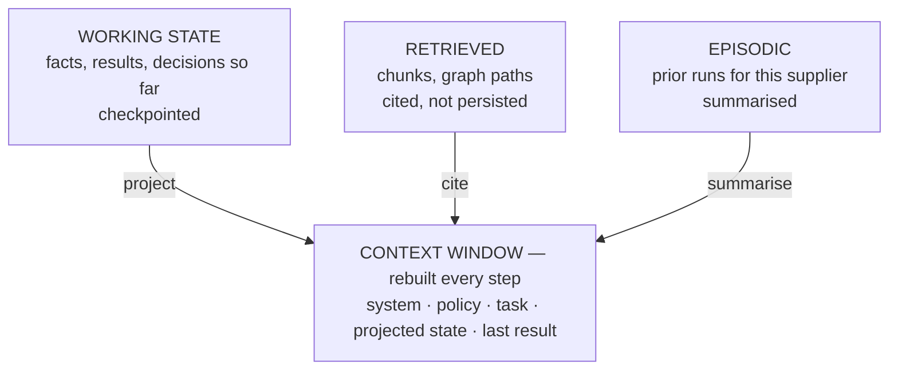

# Agent Memory

> Status: specification. Memory tiers are Phase 2; episodic memory arrives with the graph runtime's cross-thread store in Phase 6.

"Memory" in agent systems is four different mechanisms wearing one word. Conflating them is why agents forget the thing that mattered and remember the thing that did not.

## Table of contents

1. [Four tiers](#1-four-tiers)
2. [The context window](#2-the-context-window)
3. [Working state](#3-working-state)
4. [Retrieved memory](#4-retrieved-memory)
5. [Episodic memory](#5-episodic-memory)
6. [Compaction](#6-compaction)
7. [Failure modes](#7-failure-modes)
8. [Privacy](#8-privacy)

---

## 1. Four tiers

| Tier | Question it answers | Lives in | Lifetime | Durable |
| --- | --- | --- | --- | --- |
| **Context window** | What does the model see right now? | Assembled per step | One step | No |
| **Working state** | What has this run established? | `AgentState` | One run, across interrupts | Yes |
| **Retrieved** | What does the knowledge base say? | Vector index, graph | Fetched on demand | Source is |
| **Episodic** | What happened in past runs like this? | Cross-thread store | Retention window | Yes |

The organising rule: **the context window is a projection, never an accumulator.** It is rebuilt from the tiers below on every step. This is why compaction is safe — you compress a view, not the record.



---

## 2. The context window

The scarcest resource in the system, and the one most often wasted. A long window is not a licence to fill it: attention degrades toward the middle of long contexts, cost scales with tokens, and latency scales with cost.

### Budget

Each step gets an explicit allocation, enforced by `agent/memory/window.py`. The numbers are configuration; the discipline is that they exist at all.

| Segment | Budget | Content |
| --- | --- | --- |
| System and role | ~500 tokens | Versioned prompt, negative constraints |
| Policy summary | ~300 tokens | Only the bands relevant to this order's value |
| Task | ~200 tokens | The current objective |
| Working state projection | ~1,500 tokens | Structured facts, not transcripts |
| Retrieved passages | ~2,000 tokens | Top-k after fusion and ACL filtering, cited |
| Last observation | ~1,000 tokens | Projected tool result |
| Reserve for output | ~1,000 tokens | Never encroached on |

Exceeding a segment triggers compaction of that segment, not truncation of the whole prompt. Truncating from the top silently removes the system prompt, which is how agents suddenly forget their constraints.

### Placement

Instructions go at the beginning **and** the constraints are repeated at the end. Retrieved content sits in the middle inside explicit delimiters. This is both an attention decision and a security one — see [security.md](security.md) on untrusted-content boundaries.

---

## 3. Working state

Everything the run has established, held as typed data outside the window.

```python
class AgentState(BaseModel):
    run_id: str
    principal: Principal
    purchase_order: PurchaseOrder | None
    confirmation: SupplierConfirmation | None
    line_states: dict[str, LineState]        # per-line terminal or pending
    variances: list[Variance]
    conflicts: list[SourceConflict]
    rules_fired: list[RuleRef]
    steps: list[AgentStep]
    tokens_used: int
    cost_cents: int
    stop_reason: StopReason | None
```

Three properties earn their keep:

**It is typed.** The model never edits working state directly. Tool results are parsed into these structures, so a malformed extraction fails at the boundary rather than three steps later.

**It is projected, not dumped.** A 400-field ERP purchase-order record becomes a `PurchaseOrder` with the fields the decision needs. Projection happens in the connector layer, before the data is anywhere near the window.

**It is checkpointed.** Serialisable with no live handles, so a run can be suspended for human review and resumed days later. This is the constraint that rules out putting an open HTTP client or an async generator in the state object.

### Per-line state is the unit

`line_states` is keyed by line, not by run, so a five-line order can have four lines confirmed and one escalated. Failure isolation at the line level is what makes partial results useful instead of an all-or-nothing rollback.

---

## 4. Retrieved memory

Knowledge pulled on demand: contract clauses, supplier history, part relationships. Covered in depth in [retrieval.md](retrieval.md); three rules matter to memory design.

**Retrieval is a tool call, not a preamble.** Stuffing "relevant context" into every prompt is expensive and usually wrong. The agent retrieves when the deterministic path cannot decide — a variance inside a band nobody disputes needs no contract lookup.

**Retrieved content is cited and not persisted.** It enters the window with a source reference and leaves when the step ends. What persists is the *conclusion* drawn from it, in working state, with the citation attached — so a later reviewer can check the chain without the run carrying 8,000 tokens of contract text.

**Retrieved content is untrusted.** It came from a document somebody uploaded. It is delimited, and instructions inside it are data.

---

## 5. Episodic memory

What happened in previous runs for the same supplier, part or contract. Cross-thread by definition, so it lives in a store keyed by entity rather than by run.

| Use | Value | Risk |
| --- | --- | --- |
| "This supplier has confirmed late in 6 of the last 10 orders" | Sharpens the date-slip decision | Stale patterns become prejudice |
| "This part number was remapped last quarter" | Prevents a repeated mapping error | — |
| "A human rejected this exact variance last month" | Strong signal not to auto-confirm | Encodes a one-off decision as policy |

### Rules

- **Episodic memory informs; it never decides.** It can raise a flag that changes which rule is evaluated. It cannot substitute for the rule. Otherwise policy silently drifts into whatever the history happens to contain.
- **It is summarised, not replayed.** Ten prior runs become one paragraph of statistics with counts, not ten transcripts.
- **It is scoped by tenant and ACL.** Supplier history is not shareable across tenants, and the store enforces it — a partition per tenant, not a filter applied afterwards.
- **It expires.** A retention window, because an 18-month-old delivery pattern is not evidence about this quarter.

---

## 6. Compaction

Triggered by budget, not by turn count. When a segment exceeds its allocation, that segment compacts.

| Strategy | Applied to | Keeps | Loses |
| --- | --- | --- | --- |
| **Projection** | Tool outputs | The fields the schema needs | Everything else — first and cheapest |
| **Statistical summary** | Repeated similar items | Counts, ranges, outliers | Individual instances |
| **Extractive summary** | Long documents | Sentences containing decision-relevant entities | Prose |
| **Abstractive summary** | Prior step history | A narrative of what was established | Exact wording |
| **Eviction** | Resolved lines | Nothing needed again | Detail recoverable from the trace |

Order matters. Projection is free and lossless for the decision. Writing a fresh summary costs a model call and can lose a number, so it comes last and it is checked. **The summariser must keep every number and every citation from the input**, and a property test verifies that against the reference documents.

### What is never compacted

- The system prompt and negative constraints.
- Any rule that has fired, with its version.
- Any write that has occurred, with its idempotency key.
- Any unresolved conflict.

These are the facts a reviewer or auditor needs. They stay verbatim regardless of budget pressure; if they do not fit, the run escalates rather than forgetting.

---

## 7. Failure modes

| Failure | Symptom | Mitigation |
| --- | --- | --- |
| **Context rot** | Quality degrades as the window fills; the model repeats early steps | Rebuild from working state each step, never append blindly |
| **Lost-in-the-middle** | The model ignores a fact placed mid-prompt | Instructions at both ends; retrieved content bounded and short |
| **Summarisation drift** | A number changes during compaction | Numeric-preservation property test; conclusions carry citations |
| **Stale working state** | Acting on a value that changed in the source system | Read-before-write on mutating operations; optimistic concurrency where the connector supports it |
| **Episodic overfitting** | One historical exception becomes de facto policy | Episodic informs, never decides |
| **Memory poisoning** | Injected content persists into working state and influences later runs | Only typed, validated data enters working state; retrieved text never persists verbatim |
| **Unbounded growth** | Long runs consume the budget in bookkeeping | Per-segment budgets; eviction of resolved lines |

Memory poisoning is the one specific to agentic systems and the one worth the most attention. If a malicious document's text can reach episodic memory and be replayed to a future run as trusted history, one poisoned upload compromises every subsequent run for that supplier. The defence is structural: **only typed, validated, schema-conforming data crosses into persistent memory.** Free text from a document never does.

---

## 8. Privacy

Memory is where personal data accumulates, so retention and erasure are memory concerns before they are compliance concerns.

| Tier | Contains PII? | Retention | Erasure path |
| --- | --- | --- | --- |
| Context window | Transiently | None | Nothing to erase |
| Working state | Contact names, addresses | Run lifetime + retention window | Delete by `run_id` |
| Retrieved | Whatever the source contains | Source-governed | Delete source → re-index drops it |
| Episodic | Supplier and contact patterns | Configurable window | Delete by entity key |
| Traces | Redacted at write time | Retention window | Delete by `run_id`, cascades to warehouse |

PII is redacted **at trace-write time**, not at read time, so an erasure request never has to chase copies through a warehouse. Details in [security.md](security.md).
