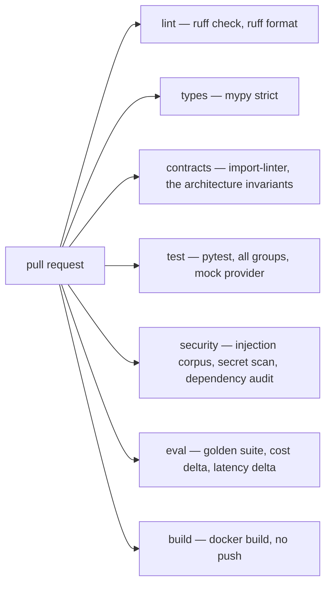

# Development and Operations

> Status: specification. Packaging is Phase 0; containers, compose and the full CI pipeline are Phase 6.

How the project is built, packaged, tested, shipped and maintained. Aimed at someone cloning the repository for the first time and at whoever has to keep it running afterwards.

## Table of contents

1. [Local development](#1-local-development)
2. [Dependency management with uv](#2-dependency-management-with-uv)
3. [Configuration](#3-configuration)
4. [Optional services](#4-optional-services)
5. [Containers](#5-containers)
6. [CI/CD](#6-cicd)
7. [Environments](#7-environments)
8. [Release](#8-release)
9. [Sustaining engineering](#9-sustaining-engineering)

---

## 1. Local development

```bash
git clone https://github.com/dileepadev/foreman.git
cd foreman
uv sync                    # creates .venv, installs from uv.lock
uv run pytest              # green, no API key, no network
uv run foreman run --scenario happy-path
```

**Under a minute from clone to a passing test suite, with no credentials.** This is a hard constraint, not an aspiration. Anyone evaluating the repository runs the tests before reading the code, and a setup that requires an API key loses most of those readers before they see anything.

### Everyday commands

| Command | Purpose |
| --- | --- |
| `uv sync` | Install exactly what the lockfile says |
| `uv sync --group models` | Add the provider SDKs |
| `uv run pytest -v` | Full suite |
| `uv run pytest -m "not slow"` | Fast feedback loop |
| `uv run ruff check --fix && uv run ruff format` | Lint and format |
| `uv run mypy .` | Type check, strict |
| `uv run foreman run --scenario <name>` | Execute a scenario |
| `uv run foreman trace <run-id>` | Render a trace |
| `uv run foreman eval` | Golden suite |
| `uv run python -m mcp_server` | MCP server over stdio |
| `uv run uvicorn api.main:app --reload` | API with reload |

### Pre-commit

Runs `ruff`, `ruff format`, `mypy` on changed files, secret scanning, and a check that no file exceeds a size threshold. Fast enough not to be disabled, which is the only property of a pre-commit hook that matters.

---

## 2. Dependency management with uv

The complete dependency list with per-package rationale lives in [tech-stack.md](tech-stack.md); this section covers the workflow.

uv over pip, Poetry or pip-tools for four reasons that matter to this project specifically: a real lockfile, resolution fast enough that CI is not waiting on it, dependency groups that keep the default install tiny, and one tool for environment, install and run.

### Layout

```toml
[project]
name = "foreman"
requires-python = ">=3.12"
dependencies = ["pydantic>=2.9", "pydantic-settings>=2.5", "httpx>=0.27", "typer>=0.12"]

[dependency-groups]
dev = ["pytest", "pytest-asyncio", "pytest-cov", "hypothesis", "ruff", "mypy", "import-linter"]
# api · mcp · graph · models · rag · pgvector · obs — see tech-stack.md §4
```

The full file, including every group, the tool configuration and the `import-linter` contracts, is in [tech-stack.md §5](tech-stack.md#5-the-complete-pyprojecttoml). It is maintained in one place on purpose — a `pyproject.toml` duplicated across two documents drifts within a week.

**The base install is four packages.** Everything else is a group, which is what makes "runs on a clean clone with no services" true rather than aspirational. A reader who only wants to see the rules engine and the agent loop installs almost nothing.

### Lockfile discipline

| Rule | Why |
| --- | --- |
| `uv.lock` is committed | Reproducible builds |
| CI uses `uv sync --locked` | Fails if the lock is stale rather than silently resolving |
| Docker uses `--locked` | The image matches what was tested |
| Lock updates are their own commit | A dependency bump is never buried in a feature diff |

---

## 3. Configuration

Settings via Pydantic, loaded from the environment, with a feature flag for every optional service.

```python
class Settings(BaseSettings):
    env: Literal["dev", "test", "prod"] = "dev"

    # Provider chain per tier. A provider with no key is skipped, so the
    # defaults below degrade to "mock" on a clean clone with no .env.
    tier_small: list[str] = ["mock"]
    tier_large: list[str] = ["mock"]

    ollama_base_url: str = "http://localhost:11434"
    openai_api_key: SecretStr | None = None
    anthropic_api_key: SecretStr | None = None
    google_api_key: SecretStr | None = None
    groq_api_key: SecretStr | None = None
    openrouter_api_key: SecretStr | None = None

    runtime: Literal["native", "graph"] = "native"

    enable_graph_store: bool = False
    enable_pgvector: bool = False
    enable_langfuse: bool = False

    max_cost_per_run_cents: int = 10
    max_cost_per_day_cents: int = 100
    kill_switch: bool = False

    model_config = SettingsConfigDict(env_prefix="FOREMAN_", env_file=".env")
```

Three properties:

- **Defaults are the zero-cost path.** `mock` provider, native runtime, no optional services. A clone with no `.env` works.
- **Secrets are `SecretStr`.** They do not appear in a repr, a log line or an error.
- **Every optional service has a flag**, and the code path when the flag is off is a tested fallback, not an exception.

`.env.example` documents every variable. `.env` is git-ignored.

---

## 4. Optional services

```bash
docker compose up -d neo4j       # graph backend
docker compose up -d postgres    # pgvector
docker compose up -d ollama      # local models
docker compose up -d langfuse    # tracing UI
docker compose up -d             # everything
```

| Service | Enables | Fallback when absent |
| --- | --- | --- |
| Neo4j | Cypher traversal at scale | In-memory graph |
| Postgres + pgvector | Persistent vector index | In-memory numpy |
| Ollama | Local model inference | Mock provider |
| Langfuse | Trace UI, datasets, scores | JSONL traces + CLI viewer |

**Every fallback is exercised in CI.** A fallback that is never tested is a fallback that does not work, and it will be discovered at the worst moment — when the service it replaces has just gone down.

---

## 5. Containers

Multi-stage build with uv, following the pattern uv documents for production images.

```dockerfile
FROM python:3.12-slim AS builder
COPY --from=ghcr.io/astral-sh/uv:latest /uv /uvx /bin/
ENV UV_PYTHON_DOWNLOADS=0
WORKDIR /app

RUN --mount=type=cache,target=/root/.cache/uv \
    --mount=type=bind,source=uv.lock,target=uv.lock \
    --mount=type=bind,source=pyproject.toml,target=pyproject.toml \
    uv sync --locked --no-install-project --no-editable --group api --group obs

COPY . /app
RUN --mount=type=cache,target=/root/.cache/uv \
    uv sync --locked --no-editable --group api --group obs

FROM python:3.12-slim
RUN useradd -r -u 1001 foreman
COPY --from=builder --chown=foreman:foreman /app/.venv /app/.venv
WORKDIR /app
USER foreman
ENV PATH="/app/.venv/bin:$PATH"
EXPOSE 8000
HEALTHCHECK --interval=30s --timeout=3s CMD python -c "import httpx;httpx.get('http://localhost:8000/health').raise_for_status()"
CMD ["uvicorn", "api.main:app", "--host", "0.0.0.0", "--port", "8000"]
```

| Choice | Reason |
| --- | --- |
| Multi-stage | uv and build caches never reach the final image |
| Dependency layer before source | Source changes do not re-resolve dependencies |
| `--locked` | The image contains exactly what was tested |
| `--no-editable` | The project is installed into the venv, so only `.venv` is copied |
| Cache mounts | Fast rebuilds without fat layers |
| Non-root user | Baseline container hygiene |
| Healthcheck | Orchestrators need a liveness signal |

---

## 6. CI/CD

### On every pull request



All jobs run in parallel and all are required. The evaluation gate is the distinctive one: **a pull request that regresses the golden traces, or raises cost per run by more than 20%, does not merge.** Thresholds and reporting: [evaluation.md](evaluation.md) §9.

### CI uses no paid API

Everything runs against the mock provider. A nightly workflow runs the suite against a local model; a manual workflow runs it against a frontier model when a routing or provider change needs evidence. A test suite that costs money per run is a test suite people learn to skip.

### On merge to main

Build and push the image, publish the evaluation report, update the trend dashboard.

### On tag

Build, push with a version tag, generate release notes from the changelog, create the GitHub release. Process in [VERSIONING.md](../VERSIONING.md).

### Caching

`astral-sh/setup-uv` with its cache enabled, keyed on `uv.lock`. Dependency install drops to a few seconds, which is what keeps the full gate under five minutes — and a gate under five minutes is one people wait for instead of merging around.

---

## 7. Environments

| | **dev** | **test** | **prod profile** |
| --- | --- | --- | --- |
| Provider | mock or local | mock | hosted with router |
| Runtime | native | native | graph |
| Writes | Mock connectors | Mock connectors | Mock connectors — this project never writes to a real system |
| Store | SQLite | In-memory | Postgres |
| Traces | JSONL | JSONL | Langfuse + JSONL |
| Budget | $0.10/run | $0 | Configured, enforced |
| Auth | Disabled by default | Fixture principals | Required |

The "prod profile" is a configuration used to exercise the production code paths. **There is no production deployment**, and the repository does not pretend otherwise.

---

## 8. Release

Per [VERSIONING.md](../VERSIONING.md). The pre-tag checklist:

1. CI green on `main`.
2. Golden suite at 100%, evaluation report attached.
3. `CHANGELOG.md` updated with categorised entries.
4. README status table matches reality — this is the one that slips.
5. Version bumped in `pyproject.toml`, `uv lock` refreshed.
6. Docs describing changed modules updated in the same commit.
7. Tag, push, publish the release with the changelog section.

Release cuts by capability: [FOREMAN_SPEC.md](FOREMAN_SPEC.md) §11.

---

## 9. Sustaining engineering

What it takes to keep an agent system working after it ships, which is different from what it takes to build one.

### Routine

| Cadence | Task |
| --- | --- |
| Daily | Review the escalation queue age; check the canary prompt |
| Weekly | Drift report; cost trend; tool failure rates |
| Weekly | Sampled audit of auto-resolved runs (the silent-error check) |
| Monthly | Dependency updates; re-run the judge calibration |
| Quarterly | Review rules that never fire; review thresholds against outcomes |
| On provider change | Re-benchmark cost and quality before switching |

### The failure mode of neglect

An agent system does not fail loudly when neglected. It degrades: suppliers change document formats, extraction accuracy drifts down, more cases escalate, the review queue lengthens, reviewers start approving without reading, and silent errors rise. Every step is gradual and none of them page anybody.

The drift monitors and the sampled audit exist specifically to catch this, and they are the first things dropped when nobody owns the system. **Ownership is the actual control**; the monitoring is just how the owner finds out.

### Handover artefacts

| Artefact | For |
| --- | --- |
| [runbook.md](runbook.md) | Whoever is on call |
| Agent specification | Whoever changes behaviour |
| KPI dashboard definition | Whoever monitors it |
| Golden suite | Whoever needs confidence a change is safe |
| [decisions.md](decisions.md) | Whoever asks "why is it like this" |

### Feedback into the product

Real deployments produce information nothing else does. The loop:

1. Deployment surfaces a failure or a gap.
2. It becomes a scenario in the golden suite.
3. It becomes a fix, a rule change or a documented limitation.
4. The next deployment starts from a system that cannot regress on it.

A scenario that came from a real failure is worth ten invented ones, and the golden suite growing over time is the clearest available evidence that the system is actually being used.
