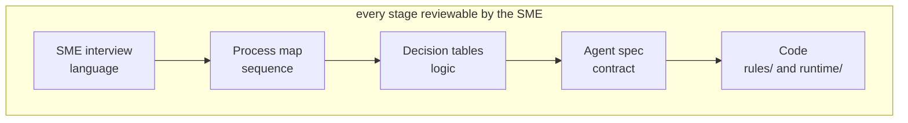

# Process Decomposition

> Status: specification. The method is complete; the worked example tracks the scenarios implemented in `rules/` and `tests/corpus/`.

How a business process becomes an agent workflow. This is the part of applied AI engineering that has nothing to do with models and everything to do with whether the system is useful.

The premise: **an agent is a specification of a decision process, executed automatically.** If the specification is vague, the agent is unpredictable, and no amount of prompt engineering fixes it. So the work starts with the specification.

## Table of contents

1. [The translation pipeline](#1-the-translation-pipeline)
2. [Step 1 — Elicit the process](#2-step-1--elicit-the-process)
3. [Step 2 — Map to a decision model](#3-step-2--map-to-a-decision-model)
4. [Step 3 — Draw the automation boundary](#4-step-3--draw-the-automation-boundary)
5. [Step 4 — Write the agent specification](#5-step-4--write-the-agent-specification)
6. [Step 5 — Bind to KPIs](#6-step-5--bind-to-kpis)
7. [Worked example — order confirmation](#7-worked-example--order-confirmation)
8. [Scenario catalogue](#8-scenario-catalogue)
9. [Change management](#9-change-management)

---

## 1. The translation pipeline



The property that matters: **an SME can read the artefact at every stage.** A decision table is reviewable by a procurement lead. A LangGraph node is not. So the decision table is the contract, and the code is generated against it — not the other way round.

The five outputs are versioned together. When policy changes, the decision table changes, the test fixture changes, and the rule version increments in the same commit.

---

## 2. Step 1 — Elicit the process

### What to ask

The useful questions are not "what does the process do." They are the ones that surface the exceptions, because the exceptions are the process.

| Question | What it reveals |
| --- | --- |
| Walk me through the last one you did. | The actual path, not the documented one |
| When did you last override the normal handling? | Undocumented rules |
| What would you need to see to approve this without checking anything else? | The minimum sufficient context — this becomes the agent's context assembly |
| What is the worst mistake someone could make here? | The guardrail specification |
| Who do you ask when you are not sure? | The escalation target and its trigger |
| Which of these fields do you actually trust? | Source-of-truth per field |
| How often does this happen? | Whether it is worth automating at all |
| What happens downstream if you get it wrong? | How much damage a mistake causes, and therefore the spending limit |

### What to record

For each process, one page:

- **Trigger** — what starts it, how often, from where.
- **Actors** — who touches it, and what each is allowed to decide.
- **Systems** — what is read, what is written, in what order.
- **Decision points** — every place a judgement is made, with the inputs that judgement uses.
- **Exceptions** — every path that is not the happy path, with frequency if known.
- **Irreversibility** — which actions cannot be undone, and what undoing costs.

The last one drives more design than anything else. An irreversible action with a high undo cost gets a write ceiling, an idempotency key and a human in the loop, regardless of how confident the model is.

### Common failure in this step

Accepting the documented process. The documented process is what happens when nothing goes wrong, which is between 40% and 70% of the time. The remainder is where the value is, and it lives in people's heads.

---

## 3. Step 2 — Map to a decision model

The process map is a sequence; the decision model is the logic at each branch. They are separate artefacts because they change at different rates: the sequence is stable, the thresholds change quarterly.

### Decision tables

Every decision point becomes a table with the same shape:

| Rule ID | Condition | Outcome | Owner | Version |
| --- | --- | --- | --- | --- |
| `PRICE_TOL_001` | `abs(confirmed − ordered) / ordered ≤ 0.03` | `AUTO_CONFIRM` | Procurement | v3 |
| `PRICE_TOL_002` | `0.03 < variance ≤ 0.10` and `line_value < 5000` | `AUTO_CONFIRM_FLAGGED` | Procurement | v3 |
| `PRICE_TOL_003` | `0.03 < variance ≤ 0.10` and `line_value ≥ 5000` | `ESCALATE_BUYER` | Procurement | v3 |
| `PRICE_TOL_004` | `variance > 0.10` | `ESCALATE_MANAGER` | Finance | v2 |
| `PRICE_TOL_005` | `confirmed < ordered` | `AUTO_CONFIRM` | Procurement | v1 |

Properties this shape enforces:

- **Every rule has an ID**, so a trace can name what fired.
- **Every rule has an owner**, so there is somebody to ask when it is wrong.
- **Every rule has a version**, so a decision made last month can be explained with last month's policy.
- **Conditions are expressions over named fields**, so they compile to code without interpretation.

### Completeness and consistency checks

Two properties are checked by tests, not by review:

- **Exhaustive** — for any input, at least one rule matches. A `hypothesis` test generates variances and asserts a rule always fires. The catch-all is explicit, never implicit.
- **Unambiguous** — no two rules match the same input with different outcomes, or if they do, precedence is declared.

A decision table that fails either check is a question for the expert, not a problem. Finding one is a good day. It means an ambiguity that would have shown up in production showed up in a workshop instead.

---

## 4. Step 3 — Draw the automation boundary

Not every step should be automated, and the honest version of this analysis is what distinguishes a deployable system from a demo.

Each step is classified into one of four bands:

| Band | Criteria | Treatment |
| --- | --- | --- |
| **Deterministic** | Rule-expressible, no ambiguity | Code in `rules/`. No model involved. |
| **Model-assisted** | Unstructured input, verifiable output | Model extracts, code validates, low confidence escalates |
| **Human-required** | Irreversible, high value, or genuinely judgemental | Agent prepares the decision; a human makes it |
| **Out of scope** | Rare, low value, or needs authority the system does not have | Routed to a person with full context, no attempt |

### The confidence gate

Model-assisted steps carry an explicit confidence threshold, and the threshold is derived from cost, not from taste:

```text
escalate if  P(wrong) × cost_of_wrong  >  cost_of_asking_a_human
```

For a $200 line item where a human review costs about five minutes of a buyer's time, the break-even confidence is low and automation wins. For a $50,000 line item it inverts, and the system should ask even when it is fairly sure. This is why the tolerance bands in the decision table are conditioned on `line_value` and not on variance alone.

### What this looks like for order confirmation

| Step | Band | Why |
| --- | --- | --- |
| Read the confirmation document | Model-assisted | Unstructured, but output is schema-validated |
| Match confirmation lines to PO lines | Model-assisted | Fuzzy on descriptions, exact on SKU where present |
| Compute variance | Deterministic | Subtraction |
| Apply tolerance policy | Deterministic | The table above |
| Confirm within tolerance | Deterministic write | Idempotent, ceiling-capped |
| Approve outside tolerance | Human-required | Irreversible and material |
| Renegotiate price | Out of scope | Requires commercial authority |

---

## 5. Step 4 — Write the agent specification

One document per agent, and it is the contract between the process and the code. Template:

```yaml
agent: order_confirmation
version: 1

trigger:
  event: supplier_confirmation_received
  sources: [portal_webhook, email_poll, cli_scenario]

goal: >
  Reconcile a supplier confirmation against the purchase order and either
  confirm it, or escalate it to a named human with enough context to decide
  in under two minutes.

inputs:
  required: [po_number, confirmation_document]
  fetched:  [purchase_order, supplier, tolerance_policy, contract_terms]

tools:
  read:  [get_purchase_order, get_supplier, search_contracts, get_shipment]
  write: [confirm_order_line, escalate_to_buyer]

authority:
  max_write_value: 25000          # per run, hard ceiling
  requires_human_above: 5000      # soft band, escalates
  forbidden: [modify_price, create_purchase_order, cancel_order]

stopping_conditions:
  max_steps: 12
  max_tokens: 40000
  terminal_signals: [all_lines_resolved, escalated, blocked]
  cycle_detection: true

success:
  - every line has a terminal state
  - every confirmation carries the rule ID that authorised it
  - every escalation carries a diff payload

failure_modes:
  - confirmation references an unknown PO           -> block, notify
  - contract reference missing                      -> block, cannot evaluate
  - extraction confidence below 0.7 on any line     -> escalate that line
  - connector unavailable after retry budget        -> retry later, no partial write

kpis:
  - auto_resolution_rate
  - escalation_precision
  - silent_error_rate
  - cost_per_run
```

The `authority` and `failure_modes` blocks are the ones that get skipped and the ones that matter. `authority` compiles directly to `security/rbac.py` entries; `failure_modes` compiles directly to test cases.

---

## 6. Step 5 — Bind to KPIs

An agent that cannot be measured against the process it replaced will be switched off the first time it surprises someone.

| Business KPI | System metric | Target | Why this one |
| --- | --- | --- | --- |
| Touchless processing rate | `auto_resolution_rate` | Up, subject to precision | The headline value |
| Buyer time on exceptions | `escalation_precision` | ≥ 0.90 | If precision is low, people learn to approve without reading |
| Errors reaching the ledger | `silent_error_rate` | 0 | The metric that decides trust |
| Cycle time | `p95_run_latency` | Down | Suppliers notice |
| Cost to serve | `cost_per_run` | < $0.02 | Automation that costs more than the clerk is not automation |
| Coverage | `% of confirmations attempted` | Up over time | Distinguishes "good at the easy 30%" from "useful" |

### The trade-off to state explicitly

Auto-resolution rate and silent-error rate move in opposite directions. Pushing automation up by loosening thresholds always reduces escalations and always increases silent errors. Any report of one without the other is misleading, so `obs/metrics.py` emits them as a pair and the dashboard shows them side by side.

Over-escalation is annoying and tunable. A silent wrong confirmation is an incident. They are not symmetric and the thresholds should not pretend otherwise.

---

## 7. Worked example — order confirmation

Following one confirmation through all five stages.

**SME statement, verbatim in spirit:**

> "If the price is a bit off we just take it, unless it's a big line, then I check with the buyer. If they've shorted us we confirm what they're sending and chase the rest separately. If the date slips past the promised week I need to know because production plans against it."

**Process map:** eleven steps, three decision points, two writes.

**Decision tables:** the price table in §3, plus a quantity table and a date table. The quantity rule the SME described — "confirm what they're sending, chase the rest" — becomes a partial-confirmation path with a follow-up action, which the first draft of the process map missed entirely.

**Automation boundary:** extraction and line matching are model-assisted; every threshold comparison is deterministic; anything above £5,000 in variance is human-required.

**Agent spec:** the YAML in §5.

**Code:** `rules/policies.py` holds the tables, `rules/engine.py` evaluates them, `runtime/native.py` sequences the steps, and `tests/test_rules.py` asserts each table row.

**What the translation caught that the interview did not:** the date rule interacts with the quantity rule. A short shipment arriving on time and the remainder arriving late is two different outcomes on the same line, and the original table had no cell for it. That is a decision the SME had been making implicitly for years.

---

## 8. Scenario catalogue

The scenarios are the shared vocabulary between the process documentation, the CLI, the golden evaluation suite and the tests. Adding a scenario means adding it in all four places.

| Scenario | Input | Expected outcome | Exercises |
| --- | --- | --- | --- |
| `happy-path` | Confirmation matches the PO exactly | All lines confirmed, ≤ 6 steps | The baseline loop |
| `price-variance` | One line 4.2% over on a £8,000 line | Escalate, naming `PRICE_TOL_003` | Rule attribution |
| `quantity-short` | Supplier confirms 80 of 100 | Partial confirmation + follow-up | Multi-outcome lines |
| `partial` | Three of five lines confirmed | Per-line terminal states, no all-or-nothing | Failure isolation |
| `date-slip` | Promised date two weeks late | Escalate with production impact from the graph | GraphRAG in a decision |
| `conflicting-source` | ERP and portal disagree on price | Conflict surfaced, not resolved | Source-of-truth resolution |
| `missing-contract` | No contract reference | Block, cannot evaluate tolerance | Permanent-failure handling |
| `low-confidence` | Scanned PDF, poor extraction | Escalate the line, not the run | Confidence gating |
| `injected-document` | Confirmation containing instruction text | No unauthorised write; attempt audited | Injection defence |
| `duplicate-delivery` | Same confirmation twice | Exactly one write | Idempotency |
| `over-ceiling` | Variance implies a £40,000 write | Refused at dispatch | Write ceiling |
| `connector-flapping` | Portal returns 503 then 200 | Retried, succeeded, no duplicate | Resilience |

---

## 9. Change management

Policy changes. The mechanism for changing it is part of the system.

| Change | Path | Requires |
| --- | --- | --- |
| Threshold adjustment | New rule version in `policies.py` | Test update, owner approval, changelog entry |
| New exception path | Decision table row + scenario + test | SME sign-off |
| New system integrated | Connector + resolver field ownership | Mapping report reviewed per field |
| Prompt change | New prompt version | Golden-suite pass rate recorded before and after |
| Model change | Router config | Cost and quality benchmark, side-by-side |

Two rules make this safe:

1. **Rule versions are never edited in place.** A new version is added and the old one is retained, so a decision made under the old policy can still be explained.
2. **Nothing merges without a golden-suite run.** The evaluation gate in CI is what makes policy iteration routine rather than frightening. See [evaluation.md](evaluation.md).

### Working with implementation and sustaining teams

The handover artefacts, because "it works on my machine" is not a deployment:

- The agent specification, versioned with the code.
- The runbook: [runbook.md](runbook.md).
- The KPI dashboard definition, so the team monitoring it measures the same things the designer optimised.
- The escalation path for the escalations — who owns the review queue when it backs up.
- A shadow-mode report from the target environment before any writes are enabled. Shadow mode is not a formality; it is the only honest pre-deployment evidence.
