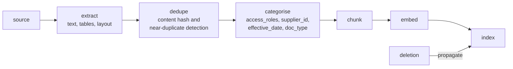
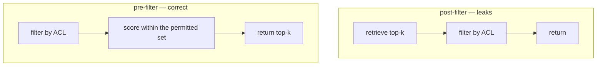
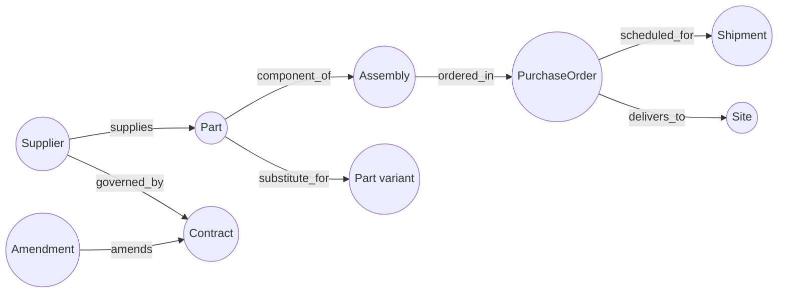

# Retrieval

> Status: specification. Ingestion, hybrid retrieval and grounded generation are Phase 3; graph community summaries land with the Neo4j backend.

Retrieval in an enterprise setting has two requirements a demo does not: it must find exact identifiers, and it must not return documents the caller may not see. Both break naive vector search, and both are load-bearing here.

## Table of contents

1. [What retrieval is for](#1-what-retrieval-is-for)
2. [Ingestion](#2-ingestion)
3. [Chunking](#3-chunking)
4. [Hybrid retrieval](#4-hybrid-retrieval)
5. [Permission-aware retrieval](#5-permission-aware-retrieval)
6. [Grounded generation](#6-grounded-generation)
7. [GraphRAG](#7-graphrag)
8. [Choosing an approach](#8-choosing-an-approach)
9. [Evaluation](#9-evaluation)

---

## 1. What retrieval is for

Foreman retrieves when the deterministic path cannot decide. Three cases, and nothing else:

| Case | Query shape | Approach |
| --- | --- | --- |
| A tolerance depends on a contract clause | "What price protection applies to contract C-4471?" | Hybrid, filtered to that contract |
| A variance needs precedent | "How were similar variances handled for this supplier?" | Hybrid over episodic summaries |
| A change has downstream impact | "If part WDG-003-A is discontinued, what is affected?" | Graph traversal |

**Retrieval is a tool call, not a preamble.** A 2% variance inside a band nobody disputes needs no contract lookup, and paying for one on every run is how a $0.02 run becomes a $0.20 run.

---

## 2. Ingestion



### Extraction

Text and tables from a mixed corpus: contracts, amendments, price lists, specifications, email bodies. **Tables matter more than prose here** — a price list rendered as a table and flattened into a text blob loses the row-column relationship that made it useful, and the retriever then returns a paragraph containing every number and none of the structure.

### Deduplication

Two stages. Exact content hashing catches the same file uploaded twice. Near-duplicate detection catches the more common and more damaging case: a contract and its lightly-edited amendment, which are 96% identical and mean different things.

Near-duplicates are **not** discarded. They are linked, with `supersedes` / `superseded_by` edges, because "which version applies" is exactly the question a reviewer asks.

### Categorisation

Classification plus metadata, and the metadata is what makes everything downstream possible:

| Field | Why |
| --- | --- |
| `doc_type` | Contract, amendment, price list, specification, correspondence |
| `access_roles` | The ACL. Attached at ingestion, enforced at query |
| `supplier_id`, `contract_ref` | Scoping filters |
| `effective_date`, `expiry_date` | Temporal validity — an expired clause is not an answer |
| `supersedes` | Version chain |
| `source_uri`, `content_hash` | Provenance and erasure |

### Incremental re-index and deletion

Re-indexing everything on every change does not scale past a demo. The pipeline processes deltas by content hash and, critically, **propagates deletions**: when a document is withdrawn, its chunks leave the index, its entities leave the graph, and its embeddings are removed.

A superseded document that stays retrievable is worse than no retrieval, because it produces a confident answer from an obsolete contract. This path is tested explicitly — delete, then assert the content is unreachable by any query.

---

## 3. Chunking

Chunk boundaries determine what can be found. The failure is always the same: a boundary lands mid-clause, and neither half is retrievable as a complete thought.

| Decision | Choice | Reason |
| --- | --- | --- |
| Boundary | Paragraph, respecting headings and table rows | Semantic units, not character counts |
| Size | ~500 tokens target, 1,000 hard cap | Fits several chunks in a window with room for reasoning |
| Overlap | ~50 tokens | Preserves cross-boundary context cheaply |
| Tables | Kept whole where possible; header row repeated per split | A price row without its header is noise |
| Metadata | Every chunk carries the parent document's full metadata | ACL filtering needs it on the chunk, not the document |

The last row is the one that gets skipped. If ACLs live on the document and the index holds chunks, filtering requires a join at query time — which is slow enough that somebody eventually moves the filter after scoring, which breaks the security model. Denormalise the metadata onto the chunk.

---

## 4. Hybrid retrieval

Dense and sparse retrieval fail in opposite directions, so Foreman runs both.

| | **Dense (embeddings)** | **Sparse (BM25)** |
| --- | --- | --- |
| Strong at | Paraphrase, synonyms, conceptual similarity | Exact tokens, identifiers, rare terms |
| Weak at | Identifiers, near-identical strings, negation | Vocabulary mismatch |
| The failure | `WDG-003-A` and `WDG-003-B` embed almost identically | "price protection" misses a clause saying "cost escalation cap" |

### The tokeniser detail that decides it

A default tokeniser splits `WDG-003-A` into `wdg`, `003`, `a`. Both part numbers now share every token, and BM25 — the component that was supposed to fix the dense retriever's identifier blindness — cannot tell them apart either.

Foreman's tokeniser **preserves hyphenated alphanumerics as single tokens** while also emitting the split forms, so `WDG-003-A` matches exactly and still partially matches a query for `WDG-003`.

### Where embeddings come from

Embeddings are produced through the provider layer, not a separate dependency: a deterministic hash-based embedding in the mock, so retrieval tests are reproducible offline and cost nothing; a local embedding model via Ollama in development; a hosted embedding endpoint when configured.

Two consequences worth stating. Embeddings are **cached by content hash** and are permanently valid for a given model, so re-indexing unchanged documents is free. And the **embedding model identifier is stored alongside every vector** — vectors from different models are not comparable, so changing the embedding model forces a full re-index rather than silently degrading every similarity score in the index.

### Fusion

Reciprocal Rank Fusion, which combines rankings rather than scores:

```text
  RRF(d) = Σ  1 / (k + rank_i(d))          k = 60
```

Scores from a cosine metric and a BM25 metric are not comparable, and normalising them requires assumptions about their distributions that do not hold. RRF sidesteps this by using only positions. It has one tunable constant and no calibration step, which is exactly the right complexity for this system.

### Optional re-ranking

A cross-encoder over the fused top-50 improves precision materially but costs a model call per candidate. Off by default; enabled per query type where the benchmark shows it pays. The point of measuring is to make that switch evidence-based rather than fashionable.

---

## 5. Permission-aware retrieval

**The ACL filter is applied before scoring, not after.**



- **Post-filter leaks.** `k` is consumed by documents the caller cannot see, so a permitted document ranked 11th disappears. Worse, the ranking itself is a side channel — response times and result counts reveal that restricted documents exist.
- **Pre-filter is correct.** The caller's world genuinely contains only what they may see.

Asking a model not to use what it has already been shown is not access control. By the time a restricted chunk is in the context window, it is in the answer, the trace, the summary and possibly the episodic memory.

### Implementation

| Concern | Approach |
| --- | --- |
| Filter timing | Pre-filter on the index, always |
| Tenant isolation | Separate index namespace per tenant, not a metadata field — a filter bug leaks across tenants, a namespace bug does not |
| Role filtering | `access_roles` intersected with the principal's roles |
| Row-level scoping | `supplier_id` constrained to what the principal may see |
| Temporal | `effective_date <= now < expiry_date` |
| Testing | Every retrieval test runs as a permitted and an unpermitted principal; the unpermitted case must return zero, not fewer |

---

## 6. Grounded generation

Retrieval that produces an unciteable answer has moved the problem, not solved it.

### Requirements

| Requirement | Mechanism |
| --- | --- |
| Every claim cites a chunk | Prompt requires inline `[source_id]`; output validated for citation presence |
| No answer without evidence | "The retrieved documents do not answer this" is a valid and expected output |
| Conflicts surfaced, not resolved | Both versions returned with dates; the rules engine or a human decides |
| Untrusted content delimited | Retrieved text wrapped in explicit boundary tags; instructions inside it are data |
| Citations verifiable | Post-generation check that each cited ID was actually retrieved |

### Conflict surfacing

The realistic case: a base contract says 3% price tolerance, an amendment dated nine months later says 5%. A generator that picks one and states it confidently is dangerous, because it will be right most of the time and catastrophically wrong occasionally.

Foreman returns both, with dates and the supersession relationship, and lets `rules/` apply the "later amendment wins unless the base contains a non-derogation clause" logic — which is a rule, and belongs in code.

### Groundedness checking

Every generated answer is checked: each claim must be supported by a cited chunk. Failures are counted as **silent errors** in `obs/metrics.py`, because an ungrounded claim that nobody flagged is precisely the failure mode this whole system is designed to make visible.

---

## 7. GraphRAG

Vector search retrieves passages that resemble a query. Some questions are not about resemblance at all.

> *If part WDG-003-A is discontinued, which parent assemblies are affected, which open purchase orders include them, and which delivery schedules slip?*

No single passage contains that answer. It is a traversal, and the relationships carry the meaning.

### The graph



| Element | Detail |
| --- | --- |
| Nodes | Supplier, Part, Assembly, PurchaseOrder, Contract, Amendment, Shipment, Site |
| Edges | `supplies`, `component_of`, `substitute_for`, `governed_by`, `amends`, `ordered_in`, `scheduled_for` |
| Construction | Entities extracted at ingestion, deterministic edges from connector data, fuzzy edges model-proposed and confidence-scored |
| Backends | In-memory by default; Cypher against Neo4j when configured |

Edges from structured connector data are trusted. Edges proposed by a model from document text carry a confidence score and are marked as such — a traversal that crosses a low-confidence edge says so in its answer.

### Query patterns

| Pattern | Question | Method |
| --- | --- | --- |
| Local traversal | "What does this part go into?" | 1–2 hop neighbourhood |
| Path finding | "How is this supplier connected to that delay?" | Shortest path with edge types |
| Impact analysis | "What breaks if this is discontinued?" | Multi-hop with cycle guards and a depth cap |
| Community summary | "What characterises this supplier cluster?" | Pre-computed cluster summaries, refreshed on re-index |

### Cost, stated honestly

GraphRAG costs more than vector search: entity extraction at ingestion, graph maintenance, and traversal at query time. It earns that cost on exactly one class of question — multi-hop relational impact — and Foreman uses it only there. Applying it to "what does this clause say" would be slower and worse than hybrid retrieval.

---

## 8. Choosing an approach

| Question shape | Approach | Why |
| --- | --- | --- |
| Exact identifier lookup | BM25-weighted hybrid | Dense alone confuses adjacent part numbers |
| Conceptual, paraphrased | Dense-weighted hybrid | Vocabulary mismatch is the failure to avoid |
| "What does this contract say about X" | Hybrid, filtered by contract | Scoping beats ranking |
| Multi-hop relational impact | Graph | No passage contains the answer |
| "Summarise this supplier relationship" | Graph community summary | Aggregate over a subgraph |
| Structured field lookup | **Not retrieval — a connector call** | Do not embed data you can query |

The last row is the one worth stating loudly. Purchase order totals live in the ERP. Embedding them so a model can approximately recall them is strictly worse than calling `get_purchase_order`. RAG is for unstructured knowledge; structured data has an API.

---

## 9. Evaluation

Retrieval is evaluated separately from generation, because a good answer from bad retrieval is luck and a bad answer from good retrieval is a prompt problem. Conflating them makes both unfixable.

### Retrieval metrics

| Metric | Target | Notes |
| --- | --- | --- |
| Recall@10 | ≥ 0.90 | Did the relevant chunk make the candidate set at all |
| MRR | ≥ 0.70 | Was it near the top |
| Exact-identifier recall@5 | 1.00 | The case dense-only fails; no tolerance for misses |
| Permission leakage | 0 | Any restricted chunk returned is a failing test, not a metric |
| p95 latency, 10k chunks | < 200ms | Retrieval sits on the critical path |

### Generation metrics

| Metric | Target |
| --- | --- |
| Citation presence | 100% of factual claims |
| Citation validity | 100% — every cited ID was retrieved |
| Groundedness | ≥ 0.95 on the golden set |
| Conflict detection recall | 1.00 on the seeded contract/amendment pairs |
| Abstention correctness | Answers "not in the documents" when it is not |

### The corpus

`tests/corpus/` ships a small, deliberately adversarial document set: part numbers one character apart, a contract with a later amendment that changes a tolerance, a superseded price list, documents with divergent ACLs, and a document containing embedded instruction text for the injection tests. Every metric above is measured against it in CI.
